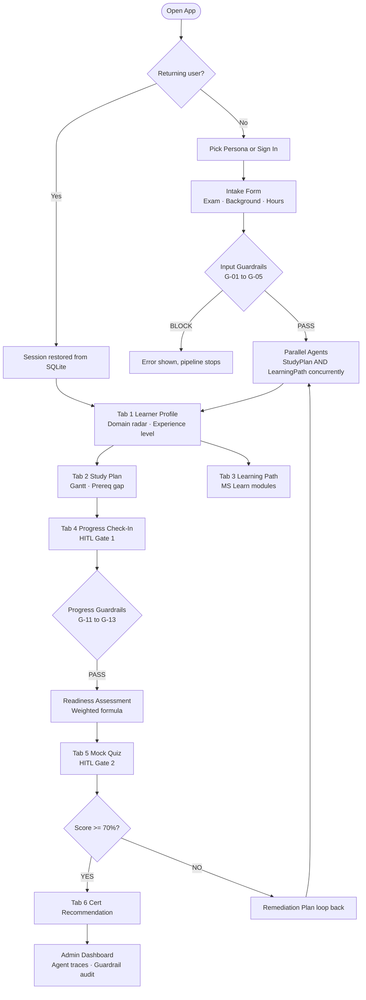
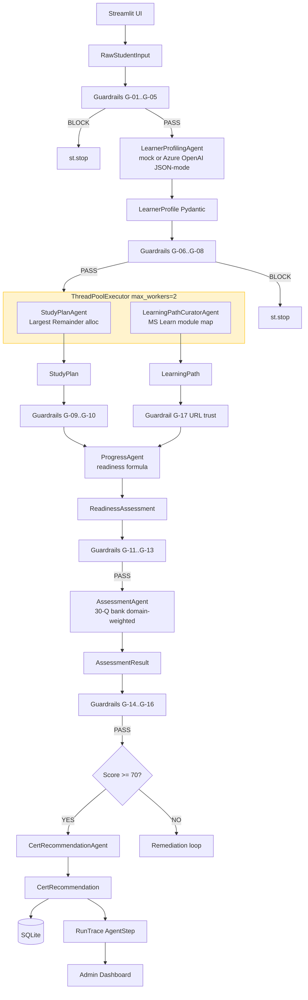

# 🏆 Agents League — Battle #2: Multi-Cert Preparation System

> **Track:** Reasoning Agents · Microsoft AI Foundry · Battle #2
> **Team:** Athiq Ahmed
> **Repo:** [athiq-ahmed/agentsleague](https://github.com/athiq-ahmed/agentsleague) *(private)*
> **Live Demo:** [agentsleague.streamlit.app](https://agentsleague.streamlit.app)

A **production-grade multi-agent AI system** for personalised Microsoft certification preparation — supporting **9 exam families** (AI-102, DP-100, AZ-204, AZ-305, AZ-400, SC-100, AI-900, DP-203, MS-102). Eight specialised reasoning agents collaborate through a typed sequential + concurrent pipeline with human-in-the-loop gates, 17 responsible AI guardrails, and full reasoning trace explainability — runnable without Azure credentials via mock mode.

---

## 🏅 Competition Alignment

| Judging Criterion | Weight | Evidence |
|---|---|---|
| **Accuracy & Relevance** | 25% | ✅ 9-cert registry; exam-weighted domain sampling; prereq gap detection per cert; MS Learn URLs validated by guardrail G-17 |
| **Reasoning & Multi-step Thinking** | 25% | ✅ 8-agent pipeline with typed handoffs; conditional routing (score ≥ 70% → GO, < 70% → remediation loop); Planner–Executor + Critic patterns |
| **Creativity & Originality** | 15% | ✅ Exam-agnostic domain registry; Largest Remainder allocation algorithm; configurable readiness formula; concurrent agent fan-out via ThreadPoolExecutor |
| **User Experience & Presentation** | 15% | ✅ 7-tab Streamlit UI; Admin Dashboard with per-agent reasoning trace; Gantt / radar / bar charts; mock mode for zero-credential demo |
| **Reliability & Safety** | 20% | ✅ 17-rule GuardrailsPipeline (BLOCK/WARN/INFO); BLOCK halts pipeline via st.stop(); URL trust guard; content heuristic filter; SQLite persistence |

**Submission requirements met:**
- [x] Multi-agent system aligned with cert prep challenge scenario
- [x] Microsoft Foundry / Azure OpenAI integration (live + mock mode)
- [x] Reasoning and multi-step decision-making across 8 agents
- [x] External tool/API integration (MS Learn module catalogue, 9-cert exam registry)
- [x] Demoable with clear agent interaction explanation (Admin Dashboard traces)
- [x] Documentation: agent roles, reasoning flow, guardrails, orchestration logic

**Optional — also delivered:**
- [x] Evaluation: explainable readiness formula + quiz scoring with verdicts
- [x] Telemetry: AgentStep / RunTrace per-step trace stored in SQLite + Admin Dashboard
- [x] Advanced reasoning: Planner–Executor + Critic/Verifier + HITL gates
- [x] Responsible AI: 17 guardrails, content filter, URL hallucination guard
- [x] Concurrent execution: ThreadPoolExecutor parallel agent fan-out (asyncio.gather() equivalent)

---

## 🗺️ User Journey



---

## ⚙️ Technical Architecture



---

## 🤖 Agent Inventory — 8 Agents

| # | Agent | Module | Input → Output | Reasoning Pattern |
|---|-------|--------|----------------|-------------------|
| 1 | **Safety Guardrails** | `guardrails.py` | Any → `GuardrailResult` | **Critic/Verifier** — 17-rule exam-agnostic middleware; BLOCK halts via st.stop() |
| 2 | **Learner Intake** | `b0_intake_agent.py` | UI form → `RawStudentInput` | **Planner** — collects background, any exam target, constraints |
| 3 | **Learner Profiler** | `b1_mock_profiler.py` | `RawStudentInput` → `LearnerProfile` | **Executor** — 40+ regex patterns; exam domain boost matrices; LLM JSON-mode in live |
| 4 | **Learning Path Curator** | `b1_1_learning_path_curator.py` | `LearnerProfile` → `LearningPath` | **Specialist** — maps weak/risk domains to MS Learn modules; skips strong domains; runs in parallel |
| 5 | **Study Plan Generator** | `b1_1_study_plan_agent.py` | `LearnerProfile` → `StudyPlan` | **Planner** — Largest Remainder week allocation; prereq gap detection; runs in parallel |
| 6 | **Progress Tracker** | `b1_2_progress_agent.py` | `ProgressSnapshot` → `ReadinessAssessment` | **Critic** — weighted readiness formula; GO/CONDITIONAL GO/NOT YET verdict |
| 7 | **Assessment Builder** | `b2_assessment_agent.py` | `LearnerProfile` → `AssessmentResult` | **Evaluator** — 30-Q bank per exam; domain-weighted sampling; per-domain score breakdown |
| 8 | **Cert Recommender** | `b3_cert_recommendation_agent.py` | `AssessmentResult` → `CertRecommendation` | **Planner** — next-cert path selection; booking checklist; remediation plan |

---

## ⚡ Concurrent Agent Execution — asyncio.gather() Pattern

Both Block 1.1 agents depend only on `LearnerProfile` — no data dependency between them — enabling true parallel fan-out.

**Sequential (before):**
```
Profiler ──► StudyPlanAgent       ~5s
         └──► LearningPathCurator ~4s  ← waited for StudyPlan to finish
                                  ─────
                             total ~9–14s (live Azure OpenAI)
```

**Concurrent — now implemented:**
```
Profiler ──► StudyPlanAgent      ─┐
         └──► LearningPathCurator ─┘► merge → guardrail checks on both outputs
                                  ─────
                             total ~5–7s  (~40% faster)
```

```python
import concurrent.futures

def _run_study_plan():
    return StudyPlanAgent().run_with_raw(profile, existing_certs=_existing_certs_list)

def _run_learning_path():
    return LearningPathCuratorAgent().curate(profile)

with concurrent.futures.ThreadPoolExecutor(max_workers=2) as executor:
    plan_future   = executor.submit(_run_study_plan)
    path_future   = executor.submit(_run_learning_path)
    plan          = plan_future.result()
    learning_path = path_future.result()
# Guardrail checks applied to both after parallel completion
```

**Why ThreadPoolExecutor over raw asyncio.gather():**
Azure OpenAI calls are I/O-bound; threads release the GIL during HTTP wait, providing genuine parallelism. Raw `asyncio.run()` inside Streamlit triggers `RuntimeError: event loop already running` without `nest_asyncio` — an external dependency. `ThreadPoolExecutor` is stdlib-only, has no loop conflict, and identical latency for network I/O.

---

## 🛡️ Guardrails — 17 Rules, Exam-Agnostic

```
Agent A  →  GuardrailsPipeline  →  Agent B
            ├── BLOCK  →  st.error() + st.stop()   (pipeline halted, no partial save)
            ├── WARN   →  st.warning()              (pipeline continues with alert)
            └── INFO   →  trace log only
```

| Rule(s) | Category | Level | What It Checks |
|---------|----------|-------|----------------|
| G-01..G-05 | **Input Validation** | BLOCK/WARN/INFO | Required fields; hours ∈ [1,80]; weeks ∈ [1,52]; exam code in dynamic registry; PII notice |
| G-06..G-08 | **Profile Integrity** | BLOCK/WARN | N domain profiles present (N = exam domain count); confidence ∈ [0,1]; risk IDs valid against registry |
| G-09..G-10 | **Study Plan Bounds** | BLOCK/WARN | No start_week > end_week; total hours ≤ 110% budget |
| G-11..G-13 | **Progress Validity** | BLOCK | hours_spent ≥ 0; self-ratings ∈ [1,5]; practice score ∈ [0,100] |
| G-14..G-15 | **Quiz Integrity** | WARN/BLOCK | Min 5 questions; no duplicate question IDs |
| G-16 | **Content Safety** | BLOCK | Heuristic harmful keyword filter on all free-text outputs |
| G-17 | **URL Trust / Anti-Hallucination** | BLOCK/WARN | Generated URLs must originate from learn.microsoft.com, pearsonvue.com, or aka.ms |

---

## 📦 Multi-Cert Domain Registry

```python
EXAM_DOMAIN_REGISTRY = {
    "AI-102": [...],   # Azure AI Engineer Associate
    "AI-900": [...],   # Azure AI Fundamentals
    "AZ-204": [...],   # Azure Developer Associate
    "AZ-305": [...],   # Azure Solutions Architect Expert
    "AZ-400": [...],   # DevOps Engineer Expert
    "DP-100": [...],   # Azure Data Scientist Associate
    "DP-203": [...],   # Azure Data Engineer Associate
    "SC-100": [...],   # Cybersecurity Architect Expert
    "MS-102": [...],   # Microsoft 365 Administrator Expert
}

# All agents use dynamic lookup — zero code change to support a new cert:
domains = get_exam_domains("DP-100")   # returns DP-100 domain weights + descriptions
```

---

## 🔀 Reasoning Patterns

| Pattern | Where |
|---------|-------|
| **Planner–Executor** | IntakeAgent (plans) → ProfilingAgent (executes extraction into typed struct) |
| **Critic / Verifier** | GuardrailsPipeline validates every agent output; ProgressAgent critiques before assessment |
| **Self-reflection & Iteration** | Score < 70% → remediation loop back to StudyPlanAgent with updated domain profile |
| **Role-based specialisation** | StudyPlan (temporal scheduling) ≠ LearningPath (content discovery) ≠ Assessment (evaluation) |
| **Human-in-the-Loop** | Gate 1: submit study hours + ratings; Gate 2: answer quiz — prevents meaningless automated scores |
| **Conditional Routing** | score ≥ 70 → CertRecommendation; else → remediation path |
| **Typed Handoff Contracts** | All agents exchange Pydantic BaseModel or dataclass — never raw strings |
| **Concurrent Fan-out** | StudyPlanAgent ∥ LearningPathCuratorAgent via ThreadPoolExecutor |

---

## 🚀 Quick Start

```bash
git clone https://github.com/athiq-ahmed/agentsleague.git
cd agentsleague
python -m venv .venv
.venv\Scripts\activate        # Windows
source .venv/bin/activate      # macOS/Linux
pip install -r requirements.txt
streamlit run streamlit_app.py  # opens http://localhost:8501
```

### Demo Credentials

| Role | Name | Credential | Journey |
|------|------|-----------|---------|
| New Learner | Alex Chen | PIN: `1234` | AI-102 from scratch |
| Returning Learner | Priyanka Sharma | PIN: `1234` | DP-100 with profile loaded |
| Admin | `admin` | Password: `agents2026` | Full trace + guardrail audit |

### Azure OpenAI (optional)
```ini
AZURE_OPENAI_ENDPOINT=https://<resource>.openai.azure.com
AZURE_OPENAI_API_KEY=<key>
AZURE_OPENAI_DEPLOYMENT=gpt-4o
AZURE_OPENAI_API_VERSION=2024-12-01-preview
```

---

## 📁 Project Structure

```
agentsleague/
├── streamlit_app.py                      # Orchestrator + 7-tab UI (~3400 lines)
├── pages/1_Admin_Dashboard.py            # Agent audit dashboard + guardrail log
├── src/cert_prep/
│   ├── models.py                         # Data contracts + EXAM_DOMAIN_REGISTRY (9 certs)
│   ├── config.py                         # Azure OpenAI config loader
│   ├── guardrails.py                     # GuardrailsPipeline — 17 exam-agnostic rules
│   ├── agent_trace.py                    # AgentStep / RunTrace observability
│   ├── b0_intake_agent.py                # Intake + Profiling agents
│   ├── b1_mock_profiler.py               # Rule-based profiler (no LLM required)
│   ├── b1_1_learning_path_curator.py     # MS Learn module curator (parallel)
│   ├── b1_1_study_plan_agent.py          # Gantt study plan generator (parallel)
│   ├── b1_2_progress_agent.py            # Readiness tracker + formula
│   ├── b2_assessment_agent.py            # Quiz builder + scorer
│   ├── b3_cert_recommendation_agent.py   # Next-cert recommender
│   └── database.py                       # SQLite persistence
├── docs/
│   ├── architecture.md
│   ├── judge_playbook.md
│   └── demo_guide.md
└── requirements.txt
```

---

## 📄 License

Created for **Microsoft Agents League** — Battle #2: Reasoning Agents. Educational and demonstration purposes.
