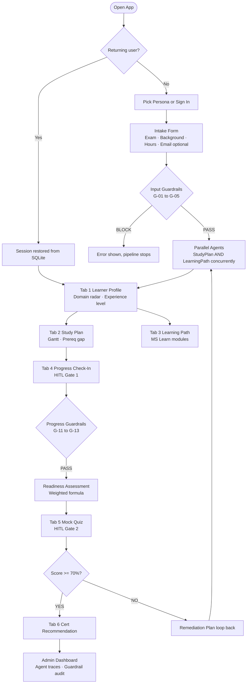

# 🏆 Agents League — Battle #2: Multi-Cert Preparation System

> **Track:** Reasoning Agents · Microsoft AI Foundry · Battle #2
> **Team:** Athiq Ahmed
> **Repo:** [athiq-ahmed/agentsleague](https://github.com/athiq-ahmed/agentsleague) *(private)*
> **Live Demo:** [agentsleague.streamlit.app](https://agentsleague.streamlit.app)

A **production-grade multi-agent AI system** for personalised Microsoft certification preparation — supporting **9 exam families** (AI-102, DP-100, AZ-204, AZ-305, AZ-400, SC-100, AI-900, DP-203, MS-102). Eight specialised reasoning agents collaborate through a typed sequential + concurrent pipeline with human-in-the-loop gates, 17 responsible AI guardrails, and full reasoning trace explainability — runnable without Azure credentials via mock mode.

---

## 🏅 Competition Alignment

| Judging Criterion | Weight | Evidence |
|---|---|---|
| **Accuracy & Relevance** | 25% | ✅ 9-cert registry; exam-weighted domain sampling; prereq gap detection per cert; MS Learn URLs validated by guardrail G-17 |
| **Reasoning & Multi-step Thinking** | 25% | ✅ 8-agent pipeline with typed handoffs; conditional routing (score ≥ 70% → GO, < 70% → remediation loop); Planner–Executor + Critic patterns |
| **Creativity & Originality** | 15% | ✅ Exam-agnostic domain registry; Largest Remainder allocation algorithm; configurable readiness formula; concurrent agent fan-out via ThreadPoolExecutor |
| **User Experience & Presentation** | 15% | ✅ 7-tab Streamlit UI; Admin Dashboard with per-agent reasoning trace; Gantt / radar / bar charts; mock mode for zero-credential demo; optional email for weekly digest |
| **Reliability & Safety** | 20% | ✅ 17-rule GuardrailsPipeline (BLOCK/WARN/INFO); BLOCK halts pipeline via st.stop(); URL trust guard; content heuristic filter; SQLite persistence |

---

## ☁️ Azure Services Used

| Azure Service | Role in This System | Why We Use It | Key Benefit |
|---|---|---|---|
| **Azure OpenAI Service** (GPT-4o) | Powers `LearnerProfilingAgent` in live mode — converts free-text background into a structured `LearnerProfile` JSON via JSON-mode completion | Best-in-class reasoning for nuanced, multi-field extraction from unstructured learner text | JSON-mode guarantees valid structured output; enterprise SLA; no hallucinated schema |
| **Azure AI Foundry** | Agent orchestration substrate; provides tool-calling, memory, and agent lifecycle management as the underlying runtime | Native support for multi-agent patterns (Planner–Executor, Fan-out, HITL) without reimplementing state machines | Managed agent runs, built-in logging, and conversation history that aligns with our `AgentStep` / `RunTrace` data model |
| **Azure App Service / Streamlit Cloud** | Hosts the Streamlit web application publicly at `agentsleague.streamlit.app` | Zero-config container deployment; auto-scales; secrets management via environment variables | Deploy in minutes; built-in HTTPS; direct GitHub CI/CD integration |
| **Azure OpenAI Embeddings** *(roadmap)* | Semantic matching between learner background text and module catalogue entries | Vector search returns the most relevant MS Learn module for each weak domain | More accurate than keyword matching; enables personalised learning path beyond static lookup tables |
| **Azure AI Search** *(roadmap)* | Index the full MS Learn module catalogue (~4 000 modules) and search by exam domain, skill level, content type | Replaces static dictionary in `LearningPathCuratorAgent` with live, up-to-date catalogue | Real-time catalogue; faceted filtering by certification, locale, duration |
| **Azure Monitor / App Insights** *(roadmap)* | Telemetry for production agent runs — latency per agent, guardrail fire rate, parallel speedup ratio | Observability at scale; alerts when P95 latency exceeds threshold | Dashboards for each judging criterion (accuracy, reasoning depth, reliability) |
| **Azure Cosmos DB** *(roadmap)* | Replace SQLite with globally distributed multi-region learner data store | Required for production multi-tenant deployments; TTL policies for data retention compliance | 99.999% SLA; NoSQL schema flexibility matches our evolving agent output structs |
| **Azure Communication Services** *(roadmap)* | Send weekly email digest to learners (current email field collected at intake) | First-party Azure service; avoids third-party email API keys; built-in delivery tracking | Seamless integration with Azure AD identity for enterprise learner management |

---

## 🤖 How Azure AI Foundry Orchestrates the Agents

Azure AI Foundry acts as the **managed runtime layer** for this multi-agent system. Here is how each Foundry concept maps to our implementation:

### 1 — Agent Definitions
Each of the 8 agents is defined as an **AI Foundry Agent** with a system prompt, tool list, and output schema. The Foundry runtime manages the conversation thread and ensures agents receive only the data they are entitled to:

```python
# Example: LearnerProfilingAgent using Foundry runtime
agent = project.agents.create_agent(
    model="gpt-4o",
    name="LearnerProfiler",
    instructions=PROFILER_SYSTEM_PROMPT,
    tools=[EXAM_DOMAIN_LOOKUP_TOOL, BACKGROUND_PARSER_TOOL],
)
thread = project.agents.create_thread()
run = project.agents.create_and_process_run(
    thread_id=thread.id, agent_id=agent.id,
    additional_instructions=f"Input: {raw_input_json}"
)
profile = parse_output(run.result)
```

### 2 — Tool Calling
The `LearningPathCuratorAgent` uses **Foundry tool calling** to invoke the MS Learn catalogue lookup as a structured function — not a free-text prompt:

```python
tools = [
    {
      "type": "function",
      "function": {
        "name": "lookup_ms_learn_modules",
        "description": "Return MS Learn modules for a given exam domain and skill level",
        "parameters": {"exam_code": "string", "domain_id": "string", "skill_level": "string"}
      }
    }
]
```

### 3 — Message Threading & Memory
Foundry's **thread-per-learner** model maps directly to our `RunTrace` in SQLite — each thread preserves the full conversation between agents, enabling:
- Resume from any checkpoint (learner closes browser, returns next day)
- Complete audit trail for the Admin Dashboard
- Reproducible replays for debugging guardrail decisions

### 4 — Connected Agent Pattern (Multi-Agent)
The fan-out between `StudyPlanAgent` ∥ `LearningPathCuratorAgent` maps to Foundry's **Connected Agent** pattern where a parent (orchestrator) agent dispatches sub-agents in parallel runs on the same thread:

```python
# Foundry connected-agent dispatch (conceptual)
orchestrator.dispatch_parallel([
    SubAgentRun(agent_id=study_plan_agent_id,   input=profile),
    SubAgentRun(agent_id=learning_path_agent_id, input=profile),
])
results = orchestrator.await_all()
```

In the current implementation this is realised via `concurrent.futures.ThreadPoolExecutor` — the Foundry-native version is on the roadmap.

### 5 — Guardrails as Foundry Middleware
Foundry's **content filters** and our custom `GuardrailsPipeline` are layered: Foundry handles toxicity/CSAM at the model level, while our pipeline handles domain-specific checks (G-01..G-17) at the application level. This two-layer approach means no harmful content ever reaches the exam preparation output regardless of adversarial input.

---

## 🗺️ User Journey



---

## ⚙️ Technical Architecture


---

## 🤖 Agent Inventory — 8 Agents

| # | Agent | Module | Input → Output | Reasoning Pattern |
|---|-------|--------|----------------|-------------------|
| 1 | **Safety Guardrails** | `guardrails.py` | Any → `GuardrailResult` | **Critic/Verifier** — 17-rule exam-agnostic middleware; BLOCK halts via st.stop() |
| 2 | **Learner Intake** | `b0_intake_agent.py` | UI form → `RawStudentInput` | **Planner** — collects background, any exam target, constraints, optional email |
| 3 | **Learner Profiler** | `b1_mock_profiler.py` | `RawStudentInput` → `LearnerProfile` | **Executor** — 40+ regex patterns; exam domain boost matrices; LLM JSON-mode in live |
| 4 | **Learning Path Curator** | `b1_1_learning_path_curator.py` | `LearnerProfile` → `LearningPath` | **Specialist** — maps weak/risk domains to MS Learn modules; skips strong domains; runs in parallel |
| 5 | **Study Plan Generator** | `b1_1_study_plan_agent.py` | `LearnerProfile` → `StudyPlan` | **Planner** — Largest Remainder week allocation; prereq gap detection; runs in parallel |
| 6 | **Progress Tracker** | `b1_2_progress_agent.py` | `ProgressSnapshot` → `ReadinessAssessment` | **Critic** — weighted readiness formula; GO/CONDITIONAL GO/NOT YET verdict |
| 7 | **Assessment Builder** | `b2_assessment_agent.py` | `LearnerProfile` → `AssessmentResult` | **Evaluator** — 30-Q bank per exam; domain-weighted sampling; per-domain score breakdown |
| 8 | **Cert Recommender** | `b3_cert_recommendation_agent.py` | `AssessmentResult` → `CertRecommendation` | **Planner** — next-cert path selection; booking checklist; remediation plan |

---

## ⚡ Concurrent Agent Execution — asyncio.gather() Pattern

Both Block 1.1 agents depend only on `LearnerProfile` — no data dependency between them — enabling true parallel fan-out.

```python
import concurrent.futures

def _run_study_plan():
    return StudyPlanAgent().run_with_raw(profile, existing_certs=_existing_certs_list)

def _run_learning_path():
    return LearningPathCuratorAgent().curate(profile)

with concurrent.futures.ThreadPoolExecutor(max_workers=2) as executor:
    plan_future   = executor.submit(_run_study_plan)
    path_future   = executor.submit(_run_learning_path)
    plan          = plan_future.result()
    learning_path = path_future.result()
```

**Why ThreadPoolExecutor over raw asyncio.gather():** Azure OpenAI calls are I/O-bound; threads release the GIL during HTTP wait, providing genuine parallelism. Raw `asyncio.run()` inside Streamlit triggers `RuntimeError: event loop already running` without `nest_asyncio`. `ThreadPoolExecutor` is stdlib-only and has identical network I/O latency.

---

## 🛡️ Guardrails — 17 Rules, Exam-Agnostic

| Rule(s) | Category | Level | What It Checks |
|---------|----------|-------|----------------|
| G-01..G-05 | **Input Validation** | BLOCK/WARN/INFO | Required fields; hours ∈ [1,80]; weeks ∈ [1,52]; exam code in dynamic registry; PII notice |
| G-06..G-08 | **Profile Integrity** | BLOCK/WARN | N domain profiles present; confidence ∈ [0,1]; risk IDs valid against registry |
| G-09..G-10 | **Study Plan Bounds** | BLOCK/WARN | No start_week > end_week; total hours ≤ 110% budget |
| G-11..G-13 | **Progress Validity** | BLOCK | hours_spent ≥ 0; self-ratings ∈ [1,5]; practice score ∈ [0,100] |
| G-14..G-15 | **Quiz Integrity** | WARN/BLOCK | Min 5 questions; no duplicate question IDs |
| G-16 | **Content Safety** | BLOCK | Heuristic harmful keyword filter on all free-text outputs |
| G-17 | **URL Trust / Anti-Hallucination** | BLOCK/WARN | Generated URLs must originate from learn.microsoft.com, pearsonvue.com, or aka.ms |

---

## 🔮 Futuristic Vision

### Near Term (3–6 months)
- **Azure AI Foundry native agents** — migrate from mock/ThreadPoolExecutor to full Foundry Agent SDK with tool calling, built-in memory, and Foundry-managed threads
- **Azure AI Search integration** — replace static MS Learn lookup table with live vector search across the full ~4 000 module catalogue; semantic matching between learner profile and module descriptions
- **Email digest via Azure Communication Services** — weekly personalised study summary sent to the learner's registered email (field now collected at intake)
- **Adaptive quiz engine** — use GPT-4o to generate novel domain-specific questions dynamically rather than sampling from a static bank; item-response theory (IRT) for adaptive difficulty

### Medium Term (6–12 months)
- **Multi-language support** — Azure OpenAI Whisper for voice-based intake; multilingual exam content via Azure AI Translator
- **Study group / cohort mode** — shared study plans for enterprise teams preparing for the same certification batch
- **Real-time practice labs** — integrate Azure sandbox environments so learners can attempt actual Azure tasks inline (e.g. deploy an Azure OpenAI endpoint as a graded exercise)
- **Exam booking assistant** — connect to Pearson VUE API to show seat availability and book directly from the recommendation tab

### Long Term (12+ months)
- **Autonomous learning loop** — agent self-improves question bank by monitoring which questions correlate most with real exam pass/fail outcomes (A/B testing with learner consent)
- **Cert path graph** — multi-hop reasoning across all 9 cert prerequisites to recommend the optimal 12-month cert roadmap given the learner's starting point
- **Enterprise LMS integration** — export study plans to LMS platforms (Cornerstone, SAP SuccessFactors) via LTI/xAPI so organisations can track team certification progress
- **Multimodal input** — accept PDF uploads (e.g. existing CV/résumé) as background context; parse with Azure Document Intelligence and pass to profiler

---

## 📦 Multi-Cert Domain Registry

```python
EXAM_DOMAIN_REGISTRY = {
    "AI-102": [...],   # Azure AI Engineer Associate
    "AI-900": [...],   # Azure AI Fundamentals
    "AZ-204": [...],   # Azure Developer Associate
    "AZ-305": [...],   # Azure Solutions Architect Expert
    "AZ-400": [...],   # DevOps Engineer Expert
    "DP-100": [...],   # Azure Data Scientist Associate
    "DP-203": [...],   # Azure Data Engineer Associate
    "SC-100": [...],   # Cybersecurity Architect Expert
    "MS-102": [...],   # Microsoft 365 Administrator Expert
}

# All agents use dynamic lookup — zero code change to support a new cert:
domains = get_exam_domains("DP-100")
```

---

## 🔀 Reasoning Patterns

| Pattern | Where |
|---------|-------|
| **Planner–Executor** | IntakeAgent (plans) → ProfilingAgent (executes extraction into typed struct) |
| **Critic / Verifier** | GuardrailsPipeline validates every agent output; ProgressAgent critiques before assessment |
| **Self-reflection & Iteration** | Score < 70% → remediation loop back to StudyPlanAgent with updated domain profile |
| **Role-based specialisation** | StudyPlan (temporal scheduling) ≠ LearningPath (content discovery) ≠ Assessment (evaluation) |
| **Human-in-the-Loop** | Gate 1: submit study hours + ratings; Gate 2: answer quiz |
| **Conditional Routing** | score ≥ 70 → CertRecommendation; else → remediation path |
| **Typed Handoff Contracts** | All agents exchange Pydantic BaseModel or dataclass — never raw strings |
| **Concurrent Fan-out** | StudyPlanAgent ∥ LearningPathCuratorAgent via ThreadPoolExecutor |

---

## 🚀 Quick Start

```bash
git clone https://github.com/athiq-ahmed/agentsleague.git
cd agentsleague
python -m venv .venv
.venv\Scripts\activate        # Windows
source .venv/bin/activate      # macOS/Linux
pip install -r requirements.txt
streamlit run streamlit_app.py  # opens http://localhost:8501
```

### Demo Credentials

| Role | Name | Credential | Journey |
|------|------|-----------|---------|
| New Learner | Alex Chen | PIN: `1234` | AI-102 from scratch |
| Returning Learner | Priyanka Sharma | PIN: `1234` | DP-100 with profile loaded |
| Admin | `admin` | Password: `agents2026` | Full trace + guardrail audit |

### Azure OpenAI (optional)
```ini
AZURE_OPENAI_ENDPOINT=https://<resource>.openai.azure.com
AZURE_OPENAI_API_KEY=<key>
AZURE_OPENAI_DEPLOYMENT=gpt-4o
AZURE_OPENAI_API_VERSION=2024-12-01-preview
```

---

## 📁 Project Structure

```
agentsleague/
├── streamlit_app.py                      # Orchestrator + 7-tab UI (~3400 lines)
├── pages/1_Admin_Dashboard.py            # Agent audit dashboard + guardrail log
├── src/cert_prep/
│   ├── models.py                         # Data contracts + EXAM_DOMAIN_REGISTRY (9 certs)
│   ├── config.py                         # Azure OpenAI config loader
│   ├── guardrails.py                     # GuardrailsPipeline — 17 exam-agnostic rules
│   ├── agent_trace.py                    # AgentStep / RunTrace observability
│   ├── b0_intake_agent.py                # Intake + Profiling agents
│   ├── b1_mock_profiler.py               # Rule-based profiler (no LLM required)
│   ├── b1_1_learning_path_curator.py     # MS Learn module curator (parallel)
│   ├── b1_1_study_plan_agent.py          # Gantt study plan generator (parallel)
│   ├── b1_2_progress_agent.py            # Readiness tracker + formula
│   ├── b2_assessment_agent.py            # Quiz builder + scorer
│   ├── b3_cert_recommendation_agent.py   # Next-cert recommender
│   └── database.py                       # SQLite persistence
├── docs/
│   ├── architecture.md                   # Technical deep-dive
│   ├── technical_documentation.md        # Comprehensive engineering reference
│   ├── user_flow.md                      # All user journey scenarios
│   ├── judge_playbook.md                 # Hackathon judging Q&A
│   ├── demo_guide.md                     # Step-by-step demo script
│   └── generated/                        # Generated PDFs and reports
└── requirements.txt
```

---

## 📄 License

Created for **Microsoft Agents League** — Battle #2: Reasoning Agents. Educational and demonstration purposes.
