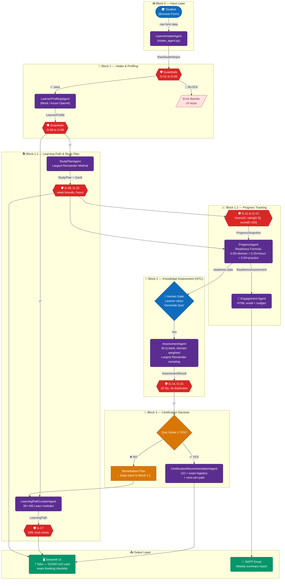

# CertPrep AI — Multi-Agent Architecture

> Microsoft Agents League 2026 · Battle #2: Reasoning Agents

---

## Agent Summary

| Block | Agent | Input | Output |
|-------|-------|-------|--------|
| 0 | **LearnerIntakeAgent** | UI form | `RawStudentInput` |
| 1 | **LearnerProfilingAgent** | `RawStudentInput` | `LearnerProfile` |
| 1.1 | **LearningPathCuratorAgent** | `LearnerProfile` | `LearningPath` |
| 1.1 | **StudyPlanAgent** | `LearnerProfile` | `StudyPlan` + Gantt |
| 1.2 | **ProgressAgent** | `ProgressSnapshot` | `ReadinessAssessment` |
| 1.2 | **Engagement Agent** | `ReadinessAssessment` | HTML email |
| 2 | **AssessmentAgent** | `LearnerProfile` | `Assessment` + `AssessmentResult` |
| 3 | **CertificationRecommendationAgent** | `AssessmentResult` | `CertRecommendation` |

## Guardrails Overview

| Rules | Category | Level |
|-------|----------|-------|
| G-01 to G-05 | Input validation | BLOCK / WARN / INFO |
| G-06 to G-08 | Profile integrity | BLOCK / WARN |
| G-09 to G-10 | Study plan bounds | BLOCK / WARN |
| G-11 to G-13 | Progress data validity | BLOCK |
| G-14 to G-15 | Quiz integrity | WARN / BLOCK |
| G-16 to G-17 | Content safety & URL trust | BLOCK / WARN |
