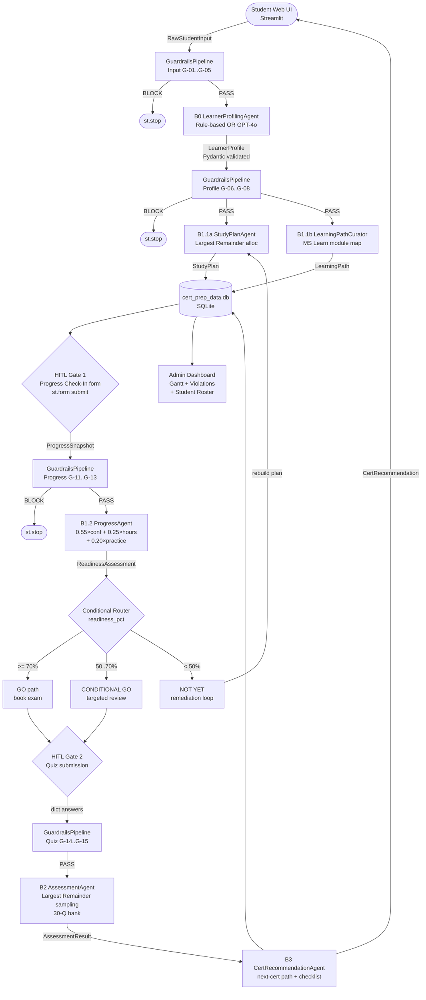

# System Architecture — Certification Prep Multi-Agent System

> Technical deep-dive for engineers, architects, and technical reviewers.
> Covers data flow, algorithms, database schema, observability, and design decisions.

---

## Development Approach & Technology Stack

**Approach chosen: Local code-first development** — built in Visual Studio Code with GitHub Copilot, tested locally, deployed to Streamlit Community Cloud.

| Category | Choice | Rationale |
|----------|--------|-----------|
| **Development approach** | Local code-first (VS Code + GitHub Copilot) | Typed handoffs, deterministic algorithms, and 17-rule guardrail pipeline are best expressed in code |
| **AI-assisted development** | GitHub Copilot | Used throughout for code generation, refactoring, and test scaffolding |
| **LLM runtime (live)** | Azure OpenAI `gpt-4o` via Azure AI Foundry-hosted deployment | JSON-mode completion; 128K context; enterprise SLA |
| **LLM runtime (mock)** | Rule-based Python engine | Deterministic, zero credentials, identical output contract |
| **Agent orchestration** | Custom Python pipeline | Sequential typed stages; `ThreadPoolExecutor` for independent parallel fan-out |
| **Agent framework** | Custom Python (`BaseModel` contracts) | Direct migration path to Microsoft Agent Framework / Foundry SDK; no redesign required |
| **Data validation** | Pydantic v2 `BaseModel` | Validated typed handoffs at every agent boundary |
| **Persistence** | SQLite (`sqlite3` stdlib) | Zero-dependency local store; schema portable to Azure Cosmos DB (roadmap) |

### What Is NOT Used (and Why)

| Tool | Status | Note |
|------|--------|------|
| Microsoft Agent Framework (OSS) | Not used in current build | Architecture is 1:1 compatible; migration path documented in README |
| Azure AI Foundry Agent Service SDK | Not used in current build | Conceptual mapping is 1:1 (see README Foundry section); `AZURE_AI_PROJECT_CONNECTION_STRING` in `.env.example` for migration |
| Foundry UI (low-code/no-code) | Not chosen | Code-first approach required for Pydantic contracts and deterministic routing |

### Compliance with Starter Kit Requirements

The project aligns with the [Battle #2 Starter Kit](https://github.com/microsoft/agentsleague/tree/main/starter-kits/2-reasoning-agents) requirements:

- ✅ **Multi-agent system** — 8 specialised agents with single bounded responsibility each
- ✅ **Azure AI (Foundry-hosted)** — live mode uses `gpt-4o` via Foundry-compatible endpoint
- ✅ **All 4 reasoning patterns** — Planner–Executor, Critic/Verifier, Self-reflection & Iteration, Role-based specialisation
- ✅ **HITL** — two human-in-the-loop gates
- ✅ **Responsible AI** — 17-rule guardrail pipeline, content safety, URL trust guard, PII handling
- ✅ **Evaluation** — 25 pytest tests, per-agent `RunTrace` observability, Admin Dashboard audit
- ✅ **GitHub Copilot** — AI-assisted development throughout

---

## High-Level Flow



---

## Agent Summary

| Agent | Module | Pattern | Input | Output |
|-------|--------|---------|-------|--------|
| GuardrailsPipeline | `guardrails.py` | Façade middleware | Any typed object | `GuardrailResult` |
| LearnerProfilingAgent | `b1_mock_profiler.py` | Sequential | `RawStudentInput` | `LearnerProfile` |
| StudyPlanAgent | `b1_1_study_plan_agent.py` | Sequential | `LearnerProfile` | `StudyPlan` |
| LearningPathCurator | `b1_1_learning_path_curator.py` | Sequential (→ parallel) | `LearnerProfile` | `LearningPath` |
| ProgressAgent | `b1_2_progress_agent.py` | Sequential + HITL | `ProgressSnapshot` | `ReadinessAssessment` |
| AssessmentAgent | `b2_assessment_agent.py` | Sequential + HITL | `LearnerProfile` | `Assessment` + `AssessmentResult` |
| CertRecommendationAgent | `b3_cert_recommendation_agent.py` | Sequential | `AssessmentResult` | `CertRecommendation` |
| RunTrace/AgentStep | `agent_trace.py` | Cross-cutting | All agents | Persisted trace records |

---

## Guardrail Architecture

The `GuardrailsPipeline` implements the **Façade pattern** — it wraps every agent boundary without any agent knowing about it. Each check method corresponds to a pipeline transition:

```python
class GuardrailsPipeline:
    def check_input(self, raw: RawStudentInput) -> GuardrailResult:       # G-01..G-05
    def check_profile(self, profile: LearnerProfile) -> GuardrailResult:  # G-06..G-08
    def check_plan(self, plan: StudyPlan) -> GuardrailResult:             # G-09..G-10
    def check_progress(self, snap: ProgressSnapshot) -> GuardrailResult:  # G-11..G-13
    def check_assessment(self, asmt: Assessment) -> GuardrailResult:      # G-14..G-15
    def check_content(self, text: str) -> GuardrailResult:               # G-16
    def check_urls(self, urls: list[str]) -> GuardrailResult:            # G-17
```

### Violation Data Model

```python
@dataclass
class GuardrailViolation:
    code: str        # "G-04"
    level: str       # "BLOCK" / "WARN" / "INFO"
    message: str
    field: str       # which input field triggered it

@dataclass
class GuardrailResult:
    passed: bool
    blocked: bool    # True if any violation has level == BLOCK
    violations: list[GuardrailViolation]
```

### Full Guardrail Catalogue

| Code | Category | Level | Rule |
|------|----------|-------|------|
| G-01 | Input Validation | BLOCK | `student_name` and `exam_target` must be non-empty |
| G-02 | Input Validation | BLOCK | `hours_per_week` ∈ [1, 80] |
| G-03 | Input Validation | BLOCK | `weeks_available` ∈ [1, 52] |
| G-04 | Input Validation | WARN | `exam_target` must be in recognised exam registry |
| G-05 | Input Validation | INFO | No background text provided |
| G-06 | Profile Integrity | BLOCK | `domain_profiles` must have exactly 6 entries |
| G-07 | Profile Integrity | BLOCK | Each `confidence` ∈ [0.0, 1.0] |
| G-08 | Profile Integrity | WARN | `risk_domains` IDs must be valid domain IDs |
| G-09 | Study Plan | BLOCK | No task with `start_week > end_week` |
| G-10 | Study Plan | WARN | Total allocated hours ≤ 110% of `total_budget_hours` |
| G-11 | Progress | BLOCK | `hours_spent` ≥ 0 |
| G-12 | Progress | BLOCK | All domain self-ratings ∈ [1, 5] |
| G-13 | Progress | BLOCK | `practice_exam_score` ∈ [0, 100] |
| G-14 | Quiz Integrity | WARN | Assessment must have ≥ 5 questions |
| G-15 | Quiz Integrity | BLOCK | No duplicate question IDs |
| G-16 | Content Safety | BLOCK | Heuristic harmful content scan on free-text fields |
| G-17 | URL Trust | WARN | All URLs must match `learn.microsoft.com`, `pearsonvue.com`, or `aka.ms` |

---

## Orchestration Patterns

### 1. Sequential Pipeline

```python
# Execution order: hard-coded, data-dependency-driven
raw     →[G-01..G-05]→ B0_Profiler  →[G-06..G-08]→
B1_Plan →  B1_Path   →[HITL-1]     → B1_Progress →
[HITL-2] → B2_Assess  → B3_CertRec
```

### 2. Typed Handoff

Every handoff is a Python type — no raw text, no unvalidated dicts:

```python
# Type chain
RawStudentInput → LearnerProfile → StudyPlan → ReadinessAssessment → AssessmentResult → CertRecommendation
```

### 3. Human-in-the-Loop Gates

```python
# Gate 1 — Progress Check-In
if not st.session_state.get("progress_submitted"):
    with st.form("progress_form"):
        ...
        if st.form_submit_button("Submit Progress"):
            st.session_state.progress_submitted = True
    st.stop()   # hard stop — downstream agents do NOT run

# Gate 2 — Quiz Submission
if not st.session_state.get("quiz_submitted"):
    render_quiz_ui()
    if st.button("Submit Quiz"):
        st.session_state.quiz_submitted = True
    st.stop()
```

### 4. Conditional Routing

```python
readiness = ProgressAgent().run(snapshot, profile)

if readiness.exam_go_nogo == "GO":              # >= 70%
    render_booking_section()
    rec = CertRecommendationAgent().run(assessment_result, profile)
elif readiness.exam_go_nogo == "CONDITIONAL GO":  # 50–70%
    render_gap_analysis()
    offer_targeted_study_resources()
else:                                           # < 50%
    render_remediation_plan()
    rebuild_study_plan(weak_domains=readiness.weak_domains)
```

---

## Database Schema

**File:** `cert_prep_data.db` (SQLite, managed by `database.py`)

```sql
CREATE TABLE students (
    id          INTEGER PRIMARY KEY AUTOINCREMENT,
    name        TEXT NOT NULL,
    pin_hash    TEXT NOT NULL,     -- SHA-256 of PIN
    exam_target TEXT,
    created_at  TIMESTAMP DEFAULT CURRENT_TIMESTAMP
);

CREATE TABLE profiles (
    id              INTEGER PRIMARY KEY AUTOINCREMENT,
    student_id      INTEGER REFERENCES students(id),
    exam_target     TEXT,
    profile_json    TEXT,          -- JSON-serialised LearnerProfile
    experience_level TEXT,
    learning_style  TEXT,
    created_at      TIMESTAMP DEFAULT CURRENT_TIMESTAMP
);

CREATE TABLE plans (
    id              INTEGER PRIMARY KEY AUTOINCREMENT,
    student_id      INTEGER REFERENCES students(id),
    plan_json       TEXT,          -- JSON-serialised StudyPlan
    learning_path_json TEXT,       -- JSON-serialised LearningPath
    total_weeks     INTEGER,
    prereq_gap      BOOLEAN,
    created_at      TIMESTAMP DEFAULT CURRENT_TIMESTAMP
);

CREATE TABLE traces (
    id              INTEGER PRIMARY KEY AUTOINCREMENT,
    student_id      INTEGER REFERENCES students(id),
    run_id          TEXT UNIQUE,
    trace_json      TEXT,          -- JSON-serialised RunTrace
    total_latency_ms REAL,
    created_at      TIMESTAMP DEFAULT CURRENT_TIMESTAMP
);

CREATE TABLE progress (
    id              INTEGER PRIMARY KEY AUTOINCREMENT,
    student_id      INTEGER REFERENCES students(id),
    hours_spent     REAL,
    domain_ratings  TEXT,          -- JSON dict {domain_id: rating}
    practice_score  REAL,
    readiness_pct   REAL,
    verdict         TEXT,
    created_at      TIMESTAMP DEFAULT CURRENT_TIMESTAMP
);
```

---

## Session State Lifecycle

Streamlit's `st.session_state` is the in-memory state store for a user session. Key state keys:

| Key | Type | Set When |
|-----|------|----------|
| `student_id` | int | After login / registration |
| `raw_input` | `RawStudentInput` | After intake form submission |
| `learner_profile` | `LearnerProfile` | After profiling agent runs |
| `study_plan` | `StudyPlan` | After study plan agent runs |
| `learning_path` | `LearningPath` | After learning path agent runs |
| `progress_submitted` | bool | After progress check-in form submit |
| `readiness` | `ReadinessAssessment` | After progress agent runs |
| `assessment` | `Assessment` | After quiz is generated |
| `quiz_submitted` | bool | After quiz answers submitted |
| `assessment_result` | `AssessmentResult` | After assessment agent scores |
| `cert_recommendation` | `CertRecommendation` | After cert rec agent runs |
| `run_trace` | `RunTrace` | Accumulated throughout session |

On page refresh, Streamlit clears `session_state`. SQLite persistence allows session recovery:

```python
# Recovery on login
student = db.get_student_by_name_pin(name, pin)
if student:
    profile_row = db.get_latest_profile(student.id)
    plan_row = db.get_latest_plan(student.id)
    st.session_state.learner_profile = LearnerProfile.model_validate_json(profile_row.profile_json)
    st.session_state.study_plan = StudyPlan.from_json(plan_row.plan_json)
```

---

## Concurrent Execution Design (Production Upgrade Path)

`StudyPlanAgent` and `LearningPathCuratorAgent` are fully independent — both only need `LearnerProfile`. Current code runs them sequentially. Production upgrade:

```python
import asyncio

async def run_planning_phase(
    profile: LearnerProfile,
    existing_certs: list[str]
) -> tuple[StudyPlan, LearningPath]:
    plan_coro = StudyPlanAgent().run_async(profile, existing_certs)
    path_coro = LearningPathCuratorAgent().run_async(profile)
    plan, path = await asyncio.gather(plan_coro, path_coro)
    return plan, path
```

**Latency improvement:**
| Execution | B0 Profiler | B1.1 Plan | B1.1 Path | Total |
|-----------|-------------|-----------|-----------|-------|
| Sequential (current) | 3.5s | 3.5s | 2.5s | ~9.5s |
| asyncio parallel | 3.5s | max(3.5, 2.5)=3.5s | (parallel) | ~7s |

---

## Data Models — Complete Reference

### Enumerations

```python
class DomainKnowledge(str, Enum):
    UNKNOWN  = "unknown"
    WEAK     = "weak"
    MODERATE = "moderate"
    STRONG   = "strong"

class LearningStyle(str, Enum):
    LINEAR    = "linear"
    LAB_FIRST = "lab_first"
    REFERENCE = "reference"
    ADAPTIVE  = "adaptive"

class ExperienceLevel(str, Enum):
    BEGINNER       = "beginner"
    INTERMEDIATE   = "intermediate"
    ADVANCED_AZURE = "advanced_azure"
    EXPERT_ML      = "expert_ml"
```

### EXAM_DOMAINS Registry (AI-102 default)

```python
AI102_DOMAINS = [
    {"id": "plan_manage",           "weight": 0.175, "name": "Plan & Manage Azure AI Solutions"},
    {"id": "computer_vision",       "weight": 0.225, "name": "Implement Computer Vision Solutions"},
    {"id": "nlp",                   "weight": 0.225, "name": "Implement NLP Solutions"},
    {"id": "document_intelligence", "weight": 0.175, "name": "Implement Document Intelligence..."},
    {"id": "conversational_ai",     "weight": 0.100, "name": "Implement Conversational AI Solutions"},
    {"id": "generative_ai",         "weight": 0.100, "name": "Implement Generative AI Solutions"},
]
```

Weights sum to exactly 1.0. These are the official Microsoft AI-102 exam domain weights.

---

## Tech Stack Decisions — With Rationale

| Component | Technology | Why This Choice |
|-----------|-----------|-----------------|
| UI | Streamlit | Rapid prototyping + built-in state management + Python-native; ideal for AI demos |
| Data models | Pydantic v2 + dataclasses | Pydantic for validation at boundaries; dataclass for simple internal containers |
| LLM | Azure OpenAI gpt-4o | Production Azure AI; structured output support; 128K context for full profile |
| Safety | Custom `GuardrailsPipeline` | Deterministic, unit-testable, no LLM call; 17 rules fully enumerable |
| Visualisation | Plotly | Interactive Gantt (timeline), bar charts, domain radar; Streamlit native integration |
| Persistence | SQLite (sqlite3 stdlib) | Zero-dependency local DB; schema portable to PostgreSQL/Cosmos DB |
| Observability | `AgentStep`/`RunTrace` custom | Per-agent latency, token count, and I/O summary in a lightweight typed struct |
| Email | SMTP | Standard; swappable to Azure Communication Services for production |
| Profiler (mock) | Rule-based Python | Fully deterministic, no LLM API cost, testable with fixed inputs, identical output contract |

---

## Deployment

### Local (Development)

```bash
pip install -r requirements.txt
streamlit run streamlit_app.py
# http://localhost:8501
```

### Streamlit Community Cloud

1. Push to GitHub (`master` branch)
2. Go to share.streamlit.io → New app → select repo + `streamlit_app.py`
3. Add secrets in Streamlit Cloud settings (Azure OpenAI keys)
4. Deploys automatically on every push to master

`.streamlit/config.toml` — Cloud-compatible settings only:
```toml
[theme]
base = "dark"
primaryColor = "#0078d4"
backgroundColor = "#1a1a2e"
secondaryBackgroundColor = "#16213e"
textColor = "#e8eaf6"
font = "sans serif"
```

### Azure Container Apps (Production)

```dockerfile
FROM python:3.11-slim
WORKDIR /app
COPY requirements.txt .
RUN pip install -r requirements.txt
COPY . .
EXPOSE 8501
CMD ["streamlit", "run", "streamlit_app.py", \
     "--server.headless=true", \
     "--server.enableCORS=false"]
```

```bash
az containerapp create \
  --name certprep-app \
  --resource-group rg-agentsleague \
  --image <acr>.azurecr.io/certprep:latest \
  --min-replicas 1 --max-replicas 10 \
  --secrets AZURE_OPENAI_KEY=<keyvault-ref> \
  --env-vars AZURE_OPENAI_ENDPOINT=<endpoint>
```
