# CertPrep AI — Multi-Agent Architecture

> Microsoft Agents League 2026 · Battle #2: Reasoning Agents

```mermaid
flowchart TD
    S(["🎓 Student\n(Browser Form)"])

    subgraph INPUT["📥 Block 0 — Input Layer"]
        S -->|"raw form data"| IA["LearnerIntakeAgent\n(intake_agent.py)"]
    end

    subgraph BLOCK1["🧠 Block 1 — Intake & Profiling"]
        IA -->|"RawStudentInput"| G_IN{{"🛡️ Guardrails\nG-01 to G-05"}}
        G_IN -->|"✅ pass"| PA["LearnerProfilingAgent\n(Mock / Azure OpenAI)"]
        G_IN -->|"🚫 BLOCK"| ERR1[/"Error Banner\nUI stops"/]
        PA -->|"LearnerProfile"| G_PF{{"🛡️ Guardrails\nG-06 to G-08"}}
    end

    subgraph BLOCK11["📚 Block 1.1 — Learning Path & Study Plan"]
        G_PF -->|"✅"| LPC["LearningPathCuratorAgent\n30+ MS Learn modules"]
        G_PF -->|"✅"| SPA["StudyPlanAgent\nLargest Remainder Method"]
        LPC -->|"LearningPath"| G_LP{{"🛡️ G-17\nURL trust check"}}
        SPA -->|"StudyPlan + Gantt"| G_SP{{"🛡️ G-09, G-10\nweek bounds, hours"}}
    end

    subgraph BLOCK12["📈 Block 1.2 — Progress Tracking"]
        G_SP --> PRA["ProgressAgent\nReadiness Formula:\n0.55×domain + 0.25×hours + 0.20×practice"]
        G_SP --> G_SN{{"🛡️ G-11 to G-13\nhours≥0, rating[1-5], score[0-100]"}}
        G_SN -->|"ProgressSnapshot"| PRA
        PRA -->|"ReadinessAssessment"| ENG["📧 Engagement Agent\nHTML email + nudges"]
    end

    subgraph BLOCK2["🧪 Block 2 — Knowledge Assessment (HITL)"]
        PRA -->|"readiness data"| HITL{"👤 Human Gate:\nLearner clicks\n'Generate Quiz'"}
        HITL -->|"Yes"| ASA["AssessmentAgent\n30-Q bank, domain-weighted\nLargest Remainder sampling"]
        ASA -->|"AssessmentResult"| G_AS{{"🛡️ G-14, G-15\n≥5 Qs, no duplicates"}}
    end

    subgraph BLOCK3["🏅 Block 3 — Certification Decision"]
        G_AS -->|"✅"| PASS{"Quiz Score ≥ 70%?"}
        PASS -->|"✅ YES"| CRA["CertificationRecommendationAgent\nGO + exam logistics\n+ next-cert path"]
        PASS -->|"❌ NO"| LOOP["Remediation Plan\n← loops back to Block 1.1"]
        LOOP --> LPC
    end

    subgraph OUTPUT["📤 Output Layer"]
        CRA --> UI["🖥️ Streamlit UI\n7 Tabs — GO/NO-GO card\nexam booking checklist"]
        ENG --> EMAIL["📨 SMTP Email\nWeekly summary report"]
        G_LP --> UI
        G_SP --> UI
    end

    %% Styles
    classDef agent    fill:#5C2D91,color:#fff,stroke:#3b1e6e,rx:6
    classDef guard    fill:#DC2626,color:#fff,stroke:#991b1b,rx:4
    classDef decision fill:#D97706,color:#fff,stroke:#92400e
    classDef output   fill:#059669,color:#fff,stroke:#047857,rx:4
    classDef error    fill:#FEE2E2,color:#991b1b,stroke:#DC2626
    classDef hitl     fill:#0F6CBD,color:#fff,stroke:#0a4a8a

    class IA,PA,LPC,SPA,PRA,ENG,ASA,CRA agent
    class G_IN,G_PF,G_LP,G_SP,G_SN,G_AS guard
    class PASS,LOOP decision
    class UI,EMAIL output
    class ERR1 error
    class HITL hitl
    class S hitl
```



---

## Agent Summary

| Block | Agent | Input | Output |
|-------|-------|-------|--------|
| 0 | **LearnerIntakeAgent** | UI form | `RawStudentInput` |
| 1 | **LearnerProfilingAgent** | `RawStudentInput` | `LearnerProfile` |
| 1.1 | **LearningPathCuratorAgent** | `LearnerProfile` | `LearningPath` |
| 1.1 | **StudyPlanAgent** | `LearnerProfile` | `StudyPlan` + Gantt |
| 1.2 | **ProgressAgent** | `ProgressSnapshot` | `ReadinessAssessment` |
| 1.2 | **Engagement Agent** | `ReadinessAssessment` | HTML email |
| 2 | **AssessmentAgent** | `LearnerProfile` | `Assessment` + `AssessmentResult` |
| 3 | **CertificationRecommendationAgent** | `AssessmentResult` | `CertRecommendation` |

## Guardrails Overview

| Rules | Category | Level | Description |
|-------|----------|-------|-------------|
| G-01 to G-05 | **Input Validation** | BLOCK / WARN / INFO | Non-empty required fields, hours/week [1–80], weeks [1–52], recognised exam codes, PII redaction notice |
| G-06 to G-08 | **Profile Integrity** | BLOCK / WARN | All 6 domains present, confidence scores in [0.0–1.0], risk domain IDs are valid |
| G-09 to G-10 | **Study Plan Bounds** | BLOCK / WARN | No `start_week > end_week`, total allocated hours ≤ 110% of budget |
| G-11 to G-13 | **Progress Data Validity** | BLOCK | Hours ≥ 0, self-ratings [1–5], practice scores [0–100] |
| G-14 to G-15 | **Quiz Integrity** | WARN / BLOCK | Minimum 5 questions, no duplicate question IDs |
| G-16 to G-17 | **Content Safety & URL Trust** | BLOCK / WARN | Heuristic harmful content detection, URLs must match `learn.microsoft.com` / `pearsonvue.com` / `aka.ms` |

### Guardrail Enforcement Architecture

```
┌─────────────────────────────────────────────────────────┐
│              GuardrailsPipeline (Façade)                 │
│                                                         │
│  ┌──────────────┐  ┌──────────────┐  ┌──────────────┐   │
│  │ InputGuard   │  │ ProfileGuard │  │ PlanGuard    │   │
│  │ G-01 to G-05 │  │ G-06 to G-08 │  │ G-09 to G-10 │   │
│  └──────────────┘  └──────────────┘  └──────────────┘   │
│  ┌──────────────┐  ┌──────────────┐  ┌──────────────┐   │
│  │ SnapGuard    │  │ AssessGuard  │  │ ContentGuard │   │
│  │ G-11 to G-13 │  │ G-14 to G-15 │  │ G-16 to G-17 │   │
│  └──────────────┘  └──────────────┘  └──────────────┘   │
└─────────────────────────────────────────────────────────┘
```

Each guardrail returns a `GuardrailResult` with:
- **`passed`** — `True` if no BLOCK-level violations
- **`violations`** — List of `GuardrailViolation(code, level, message, field)`
- **`blocked`** — Property: `True` if any BLOCK violation exists
- **`summary()`** — Human-readable summary with emoji indicators (🚫/⚠️/ℹ️)

### Guardrail Levels

| Level | Behaviour | UI Indicator |
|-------|-----------|-------------|
| **BLOCK** | Hard-stop — pipeline does not proceed | 🚫 Red error banner |
| **WARN** | Soft-stop — pipeline proceeds with visible warning | ⚠️ Yellow warning |
| **INFO** | Advisory — logged in agent trace only | ℹ️ Blue note |

---

## Agent Orchestration Patterns

### Why Orchestration Matters

As multi-agent systems grow beyond 2-3 agents, the coordination pattern determines system reliability, debuggability, and scalability. This project implements a principled approach to orchestration rather than ad-hoc agent coupling.

### Pattern 1: Sequential Pipeline (Primary)

**What:** Agents execute in a strict linear order where each agent's typed output becomes the next agent's input.

**How it works in our system:**

```
📥 RawStudentInput
  ↓  [G-01..G-05 validation]
🧠 LearnerProfile
  ↓  [G-06..G-08 validation]
🗺️ LearningPath + 📅 StudyPlan
  ↓  [G-09..G-10 + G-17 validation]
📈 ReadinessAssessment
  ↓  [G-11..G-13 validation]
🧪 AssessmentResult
  ↓  [G-14..G-15 validation]
🏅 CertRecommendation
```

**Why it fits:** Certification prep is inherently sequential — you can't build a study plan without a learner profile, and you can't assess readiness without a study plan.

**Implementation:** Each agent is a plain Python class with a `.run()` / `.curate()` / `.assess()` / `.evaluate()` / `.recommend()` method. The orchestrator is `streamlit_app.py` which invokes agents in order and stores results in `st.session_state`.

### Pattern 2: Typed Handoff

**What:** Agents pass structured, validated data objects (not raw text) to downstream agents.

**How it works in our system:**

| Source Agent | Handoff Type | Target Agent |
|-------------|-------------|-------------|
| LearnerIntakeAgent | `RawStudentInput` (dataclass) | GuardrailsPipeline → LearnerProfilingAgent |
| LearnerProfilingAgent | `LearnerProfile` (Pydantic BaseModel) | LearningPathCuratorAgent, StudyPlanAgent |
| StudyPlanAgent | `StudyPlan` (dataclass) | ProgressAgent |
| ProgressAgent | `ReadinessAssessment` (dataclass) | CertificationRecommendationAgent |
| AssessmentAgent | `AssessmentResult` (dataclass) | CertificationRecommendationAgent |

**Why it fits:** Typed handoffs provide compile-time-like safety, enable guardrail validation between stages, and make the data contract explicit.

### Pattern 3: Human-in-the-Loop (HITL) Gates

**What:** The pipeline pauses at specific points to require human input before proceeding.

**How it works in our system:**

1. **Progress Check-In Gate:** After the study plan is generated, the learner must manually submit a progress form (hours spent, self-ratings per domain, practice exam scores) before `ProgressAgent` can assess readiness.

2. **Quiz Gate:** The learner clicks "Generate New Quiz" to trigger `AssessmentAgent`, then answers questions and clicks "Submit Answers" before evaluation runs.

**Why it fits:** Certification prep requires genuine learner effort — automated pipelines without human gates would produce meaningless readiness scores.

### Pattern 4: Conditional Routing (Readiness Gate)

**What:** Pipeline branches based on assessment results rather than always following the same path.

**How it works in our system:**

```
Quiz Score ≥ 70%?
  ├── YES → CertificationRecommendationAgent → GO verdict + exam booking checklist
  └── NO  → Remediation Plan → loops back to Study Plan (Block 1.1)
```

The `CertificationRecommendationAgent` generates a `remediation_plan` with specific domain-level actions when scores are below threshold.

### Patterns for Future Implementation

| Pattern | Description | Planned Application |
|---------|------------|-------------------|
| **Concurrent (Fan-out/Fan-in)** | Multiple agents process the same input simultaneously | `LearningPathCuratorAgent` + `StudyPlanAgent` already consume `LearnerProfile` independently — ready for `asyncio.gather()` parallelisation |
| **Group Chat** | Multiple agents engage in multi-round deliberation | Profiler + domain expert agents debating a learner's skill level to refine confidence scores |
| **Magnetic** | Agents dynamically attract/route to each other based on content type signals | Content from MS Learn MCP server auto-routes to the most relevant specialist agent |
| **Copilot Studio** | Visual orchestration with built-in monitoring and human review | Enterprise deployment with admin approval gates and compliance monitoring |
