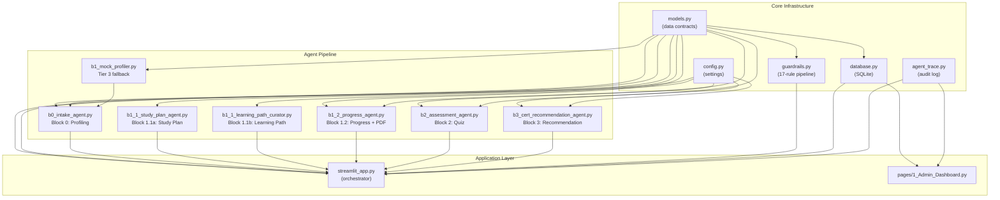
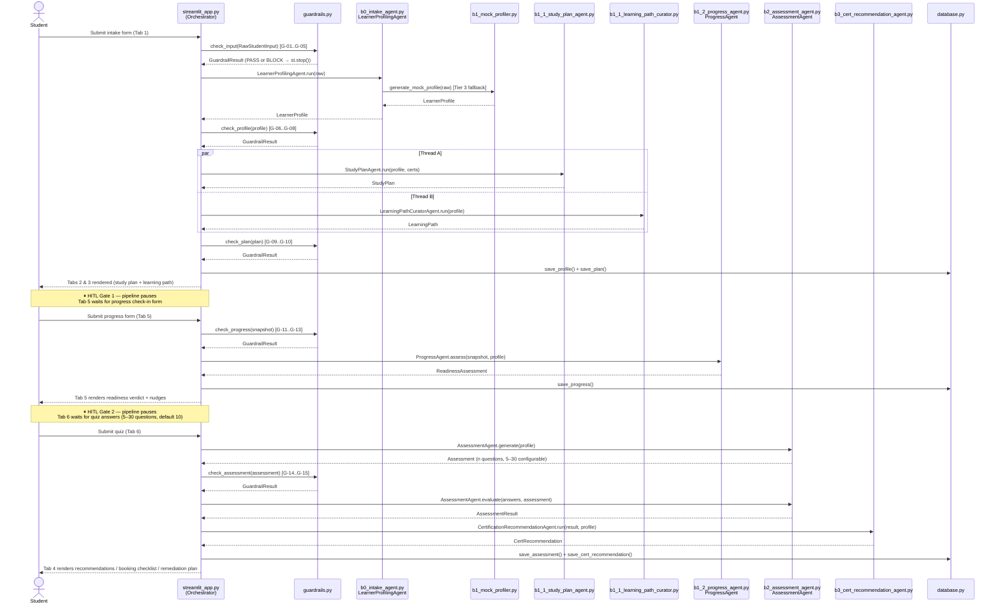

# Technical Documentation — Certification Preparation Multi-Agent System

> **Audience:** Engineers, architects, and technical reviewers.  
> **Scope:** Complete reference covering system topology, architecture, data models, every agent, core algorithms, guardrails, database schema, orchestration patterns, Azure integration, responsible AI, testing, performance, security, and deployment.

---

## Table of Contents

1. [Executive Summary](#1-executive-summary)
2. [System Topology](#2-system-topology)
   - [2.2 File-by-File Module Reference](#22-file-by-file-module-reference)
   - [2.2.1 Module Dependency Graph](#221-module-dependency-graph)
   - [2.2.2 Data Flow Between Modules](#222-data-flow-between-modules)
3. [Technology Stack](#3-technology-stack)
4. [Data Models](#4-data-models)
5. [Guardrails Framework](#5-guardrails-framework)
6. [Agent Pipeline — Deep Dive](#6-agent-pipeline--deep-dive)
7. [Core Algorithms](#7-core-algorithms)
8. [Orchestration and Concurrency](#8-orchestration-and-concurrency)
9. [Human-in-the-Loop Gates](#9-human-in-the-loop-gates)
10. [SQLite Persistence Layer](#10-sqlite-persistence-layer)
11. [Session State Lifecycle](#11-session-state-lifecycle)
12. [Mock vs Live Mode](#12-mock-vs-live-mode)
13. [Azure AI Foundry Integration](#13-azure-ai-foundry-integration)
14. [Observability and Tracing](#14-observability-and-tracing)
15. [Multi-Certification Support](#15-multi-certification-support)
16. [UI Architecture](#16-ui-architecture)
17. [Responsible AI Model](#17-responsible-ai-model)
18. [Testing Architecture](#18-testing-architecture)
19. [Performance Characteristics](#19-performance-characteristics)
20. [Security Model](#20-security-model)
21. [Deployment Options](#21-deployment-options)
22. [Migration and Roadmap](#22-migration-and-roadmap)

---

## 1. Executive Summary

The Certification Preparation Multi-Agent System is a **production-grade agentic AI application** that guides learners through a personalised Microsoft certification preparation journey. It orchestrates **8 specialised agents** in a typed sequential and concurrent pipeline, enforces **17 responsible AI guardrail rules**, and delivers personalised study plans, adaptive quizzes, and exam-readiness verdicts for **9 Microsoft exam families**.

**Key design principles:**

- **Typed handoffs at every boundary** — no raw text or unvalidated dicts cross agent borders; every message is a Pydantic `BaseModel` or dataclass
- **Deterministic algorithms** — resource allocation (Largest Remainder), readiness scoring (weighted formula), and domain sampling are fully reproducible
- **Zero-credential demo mode** — the full 8-agent pipeline runs on rule-based mock agents; Azure credentials are additive, not required
- **Exam-agnostic registry** — adding a new certification requires only a new entry in `EXAM_DOMAINS`; no agent code changes needed
- **Testable by design** — 342 automated tests pass in under 3 seconds with no Azure credentials, no network calls, and no side effects
- **Three-tier fallback** — LLM calls automatically fall back from Foundry SDK → OpenAI direct → rule-based mock, so the app never fails due to missing credentials

---

## 2. System Topology

```
┌──────────────────────────────────────────────────────────────────────────────┐
│  Browser (Student)                                                           │
│  ┌──────────────────────────────────────────────────────────────────────┐   │
│  │  Streamlit Web UI  (streamlit_app.py)                                │   │
│  │  ┌──────────────┐  ┌──────────────────────────────────────────────┐ │   │
│  │  │   Sidebar    │  │  Main Panel — 7 Tabs                         │ │   │
│  │  │  Login       │  │  Domain Map · Study Setup · Learning Path ·  │ │   │
│  │  │  Scenarios   │  │  Recommendations · Progress · Quiz · JSON    │ │   │
│  │  │  Mode badge  │  └──────────────────────────────────────────────┘ │   │
│  │  └──────────────┘                                                    │   │
│  └──────────────────────────────────────────────────────────────────────┘   │
└──────────────────────────────────────────────────────────────────────────────┘
                           │  RawStudentInput (Pydantic)
                           ▼
┌──────────────────────────────────────────────────────────────────────────────┐
│  GuardrailsPipeline  [G-01 → G-05]  Input validation + content safety       │
│                        BLOCK → st.stop()  │  PASS → continue                │
└──────────────────────────────────────────────────────────────────────────────┘
                           │  PASS
                           ▼
┌──────────────────────────────────────────────────────────────────────────────┐
│  B0 — LearnerProfilingAgent   (three-tier fallback)                          │
│  ┌────────────────┐  ┌────────────────────┐  ┌──────────────────────────┐   │
│  │  Tier 1        │  │  Tier 2            │  │  Tier 3                  │   │
│  │  Foundry SDK   │─▶│  AzureOpenAI API   │─▶│  Rule-based mock         │   │
│  │  AIProjectClient│  │  gpt-4o JSON mode  │  │  (always available)      │   │
│  └────────────────┘  └────────────────────┘  └──────────────────────────┘   │
└──────────────────────────────────────────────────────────────────────────────┘
                           │  LearnerProfile (Pydantic)
                           ▼
┌──────────────────────────────────────────────────────────────────────────────┐
│  GuardrailsPipeline  [G-06 → G-08]  Profile integrity check                 │
└──────────────────────────────────────────────────────────────────────────────┘
                           │  PASS
               ┌───────────┴──────────────┐
               ▼  Thread A                ▼  Thread B
 ┌─────────────────────────┐  ┌──────────────────────────────┐
 │  B1.1a StudyPlanAgent   │  │  B1.1b LearningPathCurator   │
 │  Largest Remainder      │  │  MS Learn module mapping     │
 │  allocation algorithm   │  │  + G-17 URL trust check      │
 └─────────────────────────┘  └──────────────────────────────┘
               │                           │
               └───────────┬───────────────┘
                           ▼
                     ┌──────────┐
                     │  SQLite  │  cert_prep_data.db
                     └──────────┘
                           │
                           ▼  (HITL Gate 1 — user submits progress form)
┌──────────────────────────────────────────────────────────────────────────────┐
│  B1.2 — ProgressAgent                                                        │
│  readiness = 0.55 × confidence + 0.25 × hours_utilisation + 0.20 × practice │
└──────────────────────────────────────────────────────────────────────────────┘
                           │  ReadinessAssessment
                           ▼
                ┌─────────────────────┐
                │  Conditional Router │
                └─────────────────────┘
       ≥ 70%    │    50–70%     │    < 50%
                ▼               ▼               ▼
          GO verdict    CONDITIONAL GO     NOT YET
                │               │               │
                └───────────────┘               └──── rebuild plan → B1.1a
                           │
                           ▼  (HITL Gate 2 — user submits quiz, 5–30 questions, default 10)
┌──────────────────────────────────────────────────────────────────────────────┐
│  B2 — AssessmentAgent   configurable domain-weighted quiz (5–30 questions, default 10) │
└──────────────────────────────────────────────────────────────────────────────┘
                           │  AssessmentResult
                           ▼
┌──────────────────────────────────────────────────────────────────────────────┐
│  B3 — CertRecommendationAgent   next-cert path + booking checklist           │
└──────────────────────────────────────────────────────────────────────────────┘
                           │
                           ▼  persisted to SQLite, rendered in all 7 tabs
```

---

## 2.2 File-by-File Module Reference

Each Python file under `src/cert_prep/` has a single, bounded responsibility.
The table below lists every module, its role in the pipeline, the typed objects
it consumes and produces, and which other modules depend on it.

| File | Role | Consumes | Produces | Used by |
|------|------|----------|----------|---------|
| `models.py` | Shared data contracts — all enums, dataclasses, Pydantic models, and the multi-exam domain registry | *(none — definition only)* | `RawStudentInput`, `LearnerProfile`, `DomainProfile`, `EXAM_DOMAIN_REGISTRY` | **all modules** |
| `config.py` | Environment variable loading; `Settings` dataclass with `is_configured` detection | `.env` / `os.environ` | `Settings`, `AzureOpenAIConfig`, … | `b0_intake_agent`, `b1_2_progress_agent`, `b2_assessment_agent`, `b3_cert_recommendation_agent`, `streamlit_app` |
| `database.py` | SQLite persistence — single `students` table; `save_*` / `load_*` functions | `sqlite3` stdlib | Serialised JSON blobs per student | `streamlit_app`, `pages/1_Admin_Dashboard.py` |
| `guardrails.py` | 17-rule responsible AI pipeline; Façade over every agent boundary | `RawStudentInput`, `LearnerProfile`, `StudyPlan`, `ProgressSnapshot`, `Assessment` | `GuardrailResult` (list of `GuardrailViolation`) | `streamlit_app` (called at every transition) |
| `agent_trace.py` | Audit log — `AgentStep` per agent; `RunTrace` per run | *(none — data class only)* | `AgentStep`, `RunTrace` | `streamlit_app`, `pages/1_Admin_Dashboard.py` |
| `eval_harness.py` | LLM-as-judge quality metrics via `azure-ai-evaluation` SDK — `CoherenceEvaluator`, `RelevanceEvaluator`, `FluencyEvaluator` per profiling run | `RawStudentInput`, `LearnerProfile`, Azure OpenAI creds | `EvalResult` (per-metric scores + `passed_threshold()`) | `streamlit_app` (post-profiling in live mode); `batch_evaluate()` for regression suites |
| `b0_intake_agent.py` | **Block 0**: CLI intake interview + LLM/mock profiling (3-tier) | `RawStudentInput`, `config.Settings`, `b1_mock_profiler` | `LearnerProfile` | `streamlit_app`, `src/demo_intake.py` |
| `b1_mock_profiler.py` | Tier 3 rule-based profiler — deterministic, no credentials needed | `RawStudentInput`, `models.EXAM_DOMAIN_REGISTRY` | `LearnerProfile` | `b0_intake_agent` (Tier 3 fallback), `streamlit_app` (mock mode), all tests |
| `b1_1_study_plan_agent.py` | **Block 1.1a**: Largest Remainder day allocation (day-level; converts to hours via `alloc_days/7 × hrs_pw`); Gantt study plan | `LearnerProfile`, `existing_certs: list[str]` | `StudyPlan` (list of `StudyTask`) | `streamlit_app` (ThreadPoolExecutor Thread A) |
| `b1_1_learning_path_curator.py` | **Block 1.1b**: Maps domains → curated MS Learn modules; G-17 URL validation | `LearnerProfile` | `LearningPath` (list of `LearningModule`) | `streamlit_app` (ThreadPoolExecutor Thread B) |
| `b1_2_progress_agent.py` | **Block 1.2** + HITL Gate 1: Readiness scoring; PDF generation; SMTP email | `ProgressSnapshot`, `LearnerProfile` | `ReadinessAssessment`, PDF bytes, HTML email | `streamlit_app` (Tab 5) |
| `b2_assessment_agent.py` | **Block 2** + HITL Gate 2: Domain-weighted configurable quiz (5–30, default 10); scoring | `LearnerProfile` | `Assessment`, `AssessmentResult` | `streamlit_app` (Tab 6) |
| `b3_cert_recommendation_agent.py` | **Block 3**: Booking checklist; next-cert progression; remediation plan | `AssessmentResult`, `LearnerProfile` | `CertRecommendation` | `streamlit_app` (Tab 4) |

### 2.2.1 Module Dependency Graph

The diagram below shows **import-time** and **runtime** dependencies between
all `src/cert_prep/` modules and the key application files.  Arrows point
from *consumer* to *dependency*.



### 2.2.2 Data Flow Between Modules

Each arrow in the pipeline carries a **typed** Python object — no raw dicts
cross a module boundary:

```
models.RawStudentInput
    └──▶ guardrails.check_input()          [G-01..G-05]
    └──▶ b0_intake_agent.LearnerProfilingAgent.run()
              └── Tier 1: azure-ai-projects AIProjectClient
              └── Tier 2: openai.AzureOpenAI  (gpt-4o JSON mode)
              └── Tier 3: b1_mock_profiler.generate_mock_profile()
              └──▶ models.LearnerProfile

models.LearnerProfile
    └──▶ guardrails.check_profile()        [G-06..G-08]
    └──▶ b1_1_study_plan_agent             ─┐  ThreadPoolExecutor
    └──▶ b1_1_learning_path_curator        ─┘  (parallel, independent)
              └──▶ StudyPlan + LearningPath
    └──▶ guardrails.check_plan()           [G-09..G-10]
    └──▶ database.save_profile() / save_plan()

         *** HITL Gate 1 — learner fills progress check-in form ***

models.ProgressSnapshot
    └──▶ guardrails.check_progress()       [G-11..G-13]
    └──▶ b1_2_progress_agent.ProgressAgent.assess()
              └──▶ ReadinessAssessment
    └──▶ database.save_progress()

         *** HITL Gate 2 — learner answers quiz (5–30 questions, default 10) ***

models.LearnerProfile (re-used)
    └──▶ b2_assessment_agent.AssessmentAgent.generate()
              └──▶ Assessment (quiz bank)
    └──▶ guardrails.check_assessment()     [G-14..G-15]
    └──▶ b2_assessment_agent.AssessmentAgent.evaluate(answers)
              └──▶ AssessmentResult

AssessmentResult + LearnerProfile
    └──▶ b3_cert_recommendation_agent.CertificationRecommendationAgent.run()
              └──▶ CertRecommendation
    └──▶ database.save_cert_recommendation()
```

---

## 3. Technology Stack

### Core Runtime

| Component | Technology | Version | Rationale |
|-----------|-----------|---------|-----------|
| Language | Python | 3.11 | Latest stable; `tomllib` stdlib; match statements |
| Web framework | Streamlit | 1.35+ | Python-native; built-in session state; rapid AI demos |
| Data validation | Pydantic v2 | 2.x | Strict typed contracts at every agent boundary |
| LLM (live) | Azure OpenAI `gpt-4o` | 2025-01-01-preview | JSON-mode; 128K context; enterprise SLA |
| Agent SDK | `azure-ai-projects` | latest | Azure AI Foundry Agent Service for `LearnerProfilingAgent` |
| Visualisation | Plotly | 5.x | Interactive Gantt, radar, bar charts; Streamlit native |
| PDF generation | ReportLab | 4.x | Programmatic PDF; no browser dependency |
| Database | SQLite (`sqlite3` stdlib) | built-in | Zero-dependency; schema portable to Cosmos DB |
| Testing | pytest | 8.x | 342 tests; no Azure credentials required |
| Concurrency | `ThreadPoolExecutor` | stdlib | Parallel fan-out for independent agents |
| Email | `smtplib` + `MIMEMultipart` | stdlib | Works with any SMTP relay |

### Development Toolchain

| Tool | Purpose |
|------|---------|
| Visual Studio Code | Primary IDE throughout development |
| GitHub Copilot | AI-assisted code generation, refactoring, and test scaffolding |
| python-dotenv | `.env` file loading for local secrets management |

---

## 4. Data Models

All models are defined in `src/cert_prep/models.py`.

### 4.1 RawStudentInput

Raw form data captured from the intake form. Validated dataclass — the entry point for the entire pipeline.

```python
@dataclass
class RawStudentInput:
    student_name:    str          # display name
    exam_target:     str          # e.g. "AI-102"
    background_text: str          # free-form experience description
    existing_certs:  list[str]    # e.g. ["AZ-900", "AI-900"]
    hours_per_week:  float        # 1–80 (G-03 enforced)
    weeks_available: int          # 1–52 (G-04 enforced)
    concern_topics:  list[str]    # up to 8 user-selected topics
    preferred_style: str          # from STYLE_OPTIONS
    goal_text:       str          # free text motivation
    email:           str = ""     # optional, for weekly digest
```

### 4.2 DomainProfile

Per-domain readiness within a `LearnerProfile`.

```python
@dataclass
class DomainProfile:
    domain_id:         str    # e.g. "computer_vision"
    domain_name:       str    # e.g. "Implement Computer Vision Solutions"
    confidence_score:  float  # 0.0–1.0 (G-07 enforced)
    knowledge_level:   DomainKnowledge   # UNKNOWN / WEAK / MODERATE / STRONG
    priority:          str    # HIGH / MEDIUM / LOW
    skill_gaps:        list[str]
    recommended_focus: str
```

### 4.3 LearnerProfile

Output of Phase 2 (profiling). Captures per-domain readiness for all downstream agents.

```python
@dataclass
class LearnerProfile:
    student_name:      str
    exam_target:       str
    experience_level:  ExperienceLevel   # BEGINNER / INTERMEDIATE / ADVANCED_AZURE / EXPERT_ML
    learning_style:    LearningStyle     # LINEAR / LAB_FIRST / REFERENCE / ADAPTIVE
    domain_profiles:   list[DomainProfile]   # one per exam domain (G-06 enforced)
    risk_domains:      list[str]             # domain IDs with confidence < 0.40
    background_text:   str
    goal_text:         str
    email:             str
    role:              str
    metadata:          dict   # profiler version, strategy used
```

### 4.4 StudyTask and StudyPlan

Output of `StudyPlanAgent`.

```python
@dataclass
class StudyTask:
    domain_id:       str
    domain_name:     str
    start_week:      int          # G-09: must be ≤ end_week
    end_week:        int
    hours_allocated: float        # from Largest Remainder algorithm
    priority:        str          # HIGH / MEDIUM / LOW
    knowledge_level: DomainKnowledge
    resources:       list[str]    # resource type descriptions
    activities:      list[str]    # specific task descriptions

@dataclass
class StudyPlan:
    student_name:       str
    exam_target:        str
    total_weeks:        int
    hours_per_week:     int
    total_budget_hours: float     # = total_weeks × hours_per_week
    tasks:              list[StudyTask]
    prereq_gap:         bool      # True if missing recommended prerequisites
    prereq_certs:       list[str] # recommended prerequisite certifications
    notes:              str
```

### 4.5 LearningModule and LearningPath

Output of `LearningPathCuratorAgent`.

```python
@dataclass
class LearningModule:
    domain_id:     str
    domain_name:   str
    title:         str
    url:           str       # G-17 trust-validated before persist
    module_type:   str       # "module" / "learning path" / "lab"
    duration_hrs:  float
    priority:      int       # 1 = highest

@dataclass
class LearningPath:
    student_name:  str
    exam_target:   str
    modules:       list[LearningModule]
    total_modules: int
    total_hours:   float
```

### 4.6 ProgressSnapshot and ReadinessAssessment

Input and output of `ProgressAgent` (HITL Gate 1).

```python
@dataclass
class ProgressSnapshot:
    student_name:   str
    hours_spent:    float          # G-11: ≥ 0
    domain_ratings: dict[str,int]  # domain_id → 1–5 (G-12 enforced)
    practice_score: int            # 0–100 (G-13 enforced)
    notes:          str

@dataclass
class ReadinessAssessment:
    readiness_pct:  float          # 0–100
    exam_go_nogo:   str            # "GO" / "CONDITIONAL GO" / "NOT YET"
    weak_domains:   list[str]      # domain IDs below threshold
    go_nogo_reason: str
    nudges:         list[str]      # specific actionable recommendations
    verdict:        str            # alias for exam_go_nogo
```

### 4.7 Assessment and AssessmentResult

Input and output of `AssessmentAgent` (HITL Gate 2).

```python
@dataclass
class QuizQuestion:
    question_id:    str
    question_text:  str
    options:        dict[str, str]   # {"A": "...", "B": "...", "C": "...", "D": "..."}
    correct_answer: str              # "A" / "B" / "C" / "D"
    domain_id:      str
    difficulty:     str              # BEGINNER / INTERMEDIATE / ADVANCED
    explanation:    str              # shown post-submission

@dataclass
class Assessment:
    questions: list[QuizQuestion]   # n questions, domain-weighted (5–30 configurable)

@dataclass
class AssessmentResult:
    total_score:     float           # 0–100, weighted by domain
    passed:          bool            # total_score >= 60
    domain_scores:   dict[str,float] # domain_id → percentage
    score_pct:       float           # alias for total_score
    pass_fail:       str             # "PASS" / "FAIL"
    correct_count:   int
    total_questions: int
    weak_domains:    list[str]       # domains scored < 60%
```

### 4.8 CertRecommendation

Output of `CertRecommendationAgent`.

```python
@dataclass
class CertRecommendation:
    current_exam:       str
    ready_to_book:      bool
    next_cert:          str
    booking_checklist:  list[str]
    consolidation_plan: str
    remediation_steps:  list[str]   # non-empty when ready_to_book=False
```

### 4.9 Enumerations

```python
class DomainKnowledge(str, Enum):
    UNKNOWN  = "unknown"
    WEAK     = "weak"
    MODERATE = "moderate"
    STRONG   = "strong"

class LearningStyle(str, Enum):
    LINEAR    = "linear"
    LAB_FIRST = "lab_first"
    REFERENCE = "reference"
    ADAPTIVE  = "adaptive"

class ExperienceLevel(str, Enum):
    BEGINNER       = "beginner"
    INTERMEDIATE   = "intermediate"
    ADVANCED_AZURE = "advanced_azure"
    EXPERT_ML      = "expert_ml"
```

---

## 5. Guardrails Framework

Defined in `src/cert_prep/guardrails.py`. Implements the **Façade pattern** — it wraps every agent boundary without any agent being aware of it.

### 5.1 Violation Levels

| Level | UI Effect | Pipeline Effect |
|-------|----------|----------------|
| **BLOCK** | `st.error()` — red banner | `st.stop()` — pipeline halts; user must fix the input |
| **WARN** | `st.warning()` — amber banner | Pipeline continues; violation logged to SQLite |
| **INFO** | `st.info()` — blue banner | Pipeline continues; purely informational |

### 5.2 All 17 Rules

| Code | Check Method | Level | Rule Description |
|------|-------------|-------|-----------------|
| G-01 | `check_input` | WARN | Background text is empty — profiling accuracy may be limited |
| G-02 | `check_input` | BLOCK | Exam target not found in `EXAM_DOMAINS` registry |
| G-03 | `check_input` | BLOCK | `hours_per_week` outside range [1, 80] |
| G-04 | `check_input` | BLOCK | `weeks_available` outside range [1, 52] |
| G-05 | `check_input` | INFO | No concern topics provided (optional field) |
| G-06 | `check_profile` | BLOCK | `domain_profiles` count does not match exam registry domain count |
| G-07 | `check_profile` | BLOCK | Any `confidence_score` outside [0.0, 1.0] |
| G-08 | `check_profile` | WARN | `risk_domains` contains IDs not in the exam's domain registry |
| G-09 | `check_plan` | BLOCK | Any task has `start_week > end_week` |
| G-10 | `check_plan` | WARN | Total allocated hours exceed 110% of `total_budget_hours` |
| G-11 | `check_progress` | BLOCK | `hours_spent` is negative |
| G-12 | `check_progress` | BLOCK | Any domain self-rating outside [1, 5] |
| G-13 | `check_progress` | BLOCK | `practice_exam_score` outside [0, 100] |
| G-14 | `check_assessment` | WARN | Assessment contains fewer than 5 questions |
| G-15 | `check_assessment` | BLOCK | Duplicate `question_id` values detected |
| G-16 | `check_content` | BLOCK/WARN | Harmful keyword (BLOCK) or PII pattern (WARN) in free-text |
| G-17 | `check_urls` | WARN | URL does not match approved learning domain allowlist |

### 5.3 Application Pattern

```python
result = guardrails.check_input(raw)
for v in result.violations:
    if v.level == "BLOCK":
        st.error(f"⚠️ [{v.code}] {v.message}")
        st.stop()
    elif v.level == "WARN":
        st.warning(f"[{v.code}] {v.message}")
    elif v.level == "INFO":
        st.info(f"[{v.code}] {v.message}")
```

### 5.4 G-16 Content Safety Detail

G-16 operates in two layers — a **live Azure Content Safety API call** (primary) and a **regex-based heuristic fallback** (when the endpoint is unconfigured).

**Primary — Azure Content Safety API (`_check_content_safety_api`):**  
When `AZURE_CONTENT_SAFETY_ENDPOINT` and `AZURE_CONTENT_SAFETY_KEY` are set, G-16 makes a live HTTP POST to `{endpoint}/contentsafety/text:analyze?api-version=2024-09-01` with categories `Hate`, `SelfHarm`, `Sexual`, `Violence`. Any category with severity **≥ 2** triggers a BLOCK.

**Fallback — Regex heuristic (when endpoint is unconfigured):**
- **Harmful keywords** → BLOCK: violence, self-harm, prohibited content (exact word match against blocklist)
- **SSN pattern** → WARN: regex `\b\d{3}-\d{2}-\d{4}\b`
- **Credit card pattern** → WARN: regex `\b\d{4}[\s-]?\d{4}[\s-]?\d{4}[\s-]?\d{4}\b`
- **Email in bio** → WARN: regex `[a-zA-Z0-9._%+-]+@[a-zA-Z0-9.-]+\.[a-zA-Z]{2,}`

PII detected via WARN is flagged to the user before any LLM call proceeds. In both layers, a network or credential failure triggers graceful fallback without crashing the pipeline.

### 5.5 G-17 URL Trust Guard

Approved domain prefixes:

```python
TRUSTED_URL_PREFIXES = [
    "https://learn.microsoft.com",
    "https://docs.microsoft.com",
    "https://aka.ms",
    "https://home.pearsonvue.com",
    "https://certiport.pearsonvue.com",
]
```

Any URL outside this list is silently removed from the `LearningPath` before persistence. The WARN banner lists removed URLs for transparency.

---

## 6. Agent Pipeline — Deep Dive

### 6.1 B0 — LearnerProfilingAgent

**File:** `src/cert_prep/b0_intake_agent.py`  
**Pattern:** Sequential with three-tier fallback  
**Input:** `RawStudentInput` → **Output:** `LearnerProfile`

The only agent that calls an external LLM. Uses a **three-tier fallback strategy**:

**Tier 1 — Azure AI Foundry Agent Service SDK** (`azure-ai-projects`):  
Creates a managed Foundry agent with a complete system prompt and conversation thread. Activated when `AZURE_AI_PROJECT_CONNECTION_STRING` is set. Uses `DefaultAzureCredential`.

**Tier 2 — Azure OpenAI direct** (`openai.AzureOpenAI`):  
Calls `gpt-4o` with `response_format={"type":"json_object"}`. Temperature 0.2 for consistent structured output. Activated when only `AZURE_OPENAI_ENDPOINT` + `AZURE_OPENAI_API_KEY` are set.

**Tier 3 — Rule-based mock engine** (`b1_mock_profiler.py`):  
No API calls. Deterministic — same input always produces same output.

**Mock profiler — three-pass algorithm:**

```python
# Pass 1 — Experience Level from background keywords
keywords = {
    "beginner": BEGINNER, "no cloud": BEGINNER, "new to": BEGINNER,
    "data scientist": EXPERT_ML, "machine learning": EXPERT_ML,
    "developer": INTERMEDIATE, "engineer": INTERMEDIATE,
    "architect": ADVANCED_AZURE, "azure": ADVANCED_AZURE, "cloud": ADVANCED_AZURE,
}
experience = max(match for kw, match in keywords.items() if kw in background.lower())

# Pass 2 — Domain Base Confidence from keyword co-occurrence
for domain in EXAM_DOMAINS[exam_target]:
    overlap = count_keyword_overlap(background_text, domain["name"])
    confidence[domain["id"]] = scale(overlap, min=0.10, max=0.75)

# Pass 3 — Concern Topic Penalty
for topic in concern_topics:
    domain_id = map_topic_to_domain(topic)
    if domain_id:
        confidence[domain_id] = max(0.05, confidence[domain_id] - 0.15)
        risk_domains.append(domain_id)
```

**Live strategy (Tier 2) — System prompt:**

```
You are a Microsoft certification preparation expert.
Given a student's background, target exam, and goals, produce a structured
LearnerProfile JSON with domain confidence scores (0.0–1.0), knowledge levels,
experience level, risk domains, and learning style recommendation.

Output ONLY valid JSON conforming to this schema: {schema}
```

---

### 6.2 B1.1a — StudyPlanAgent

**File:** `src/cert_prep/b1_1_study_plan_agent.py`  
**Pattern:** Planner–Executor  
**Input:** `LearnerProfile`, `existing_certs` → **Output:** `StudyPlan`

Allocates study time across exam domains using the **Largest Remainder algorithm at the day level** (`total_days = study_weeks × 7`; see Section 7). Each domain's relative weight is `exam_domain_weight × priority_multiplier` (critical=2.0, high=1.5, medium=1.0, low=0.5, skip=0.0). Day blocks are converted to week bands and hours: `week_hours = (alloc_days / 7) × hours_per_week`. Domains already covered by existing certs are marked `priority=LOW`. Domains with confidence below 0.40 are front-loaded into the first 40% of weeks (remediation-first scheduling).

**Prerequisite gap detection:**

```python
PREREQ_MAP = {
    "AI-102": ["AZ-900"],
    "DP-100": ["AZ-900", "DP-900"],
    "AZ-204": ["AZ-900"],
    "AZ-305": ["AZ-104", "AZ-204"],
    "SC-100": ["AZ-500", "SC-200"],
}
prereq_gap = [p for p in PREREQ_MAP.get(exam, []) if p not in existing_certs]
```

---

### 6.3 B1.1b — LearningPathCuratorAgent

**File:** `src/cert_prep/b1_1_learning_path_curator.py`  
**Pattern:** Sequential with Critic (G-17 URL validation)  
**Input:** `LearnerProfile` → **Output:** `LearningPath`

Maps each exam domain to 2–4 Microsoft Learn modules from a static curated registry. Selects module type based on learner's `learning_style` (lab-first learners receive labs before videos; reference-style learners receive documentation first). Applies G-17 trust guard — non-approved URLs are stripped before persist.

```python
for domain in profile.domain_profiles:
    candidates = MODULE_CATALOGUE[exam_target][domain.domain_id]
    # Sort by: preferred style first, then priority ascending
    selected = sorted(candidates,
                      key=lambda m: (0 if m.module_type == preferred_style else 1, m.priority))[:3]
    for m in selected:
        if validate_url_G17(m.url):
            modules.append(m)
```

---

### 6.4 B1.2 — ProgressAgent

**File:** `src/cert_prep/b1_2_progress_agent.py`  
**Pattern:** Self-Reflection and Iteration  
**Input:** `ProgressSnapshot`, `LearnerProfile` → **Output:** `ReadinessAssessment`

Computes readiness using the weighted formula (see Section 7). Produces a three-way verdict and per-domain nudges. Also generates two downloadable PDF reports via ReportLab:

| Function | Contents |
|----------|----------|
| `generate_profile_pdf(profile, plan, lp)` | Domain confidence scores, study plan Gantt table, learning path module list |
| `generate_assessment_pdf(profile, snap, asmt)` | Progress snapshot, domain readiness bars, go/no-go verdict |
| `generate_intake_summary_html(profile, plan, lp)` | HTML body for the welcome email |

All three return `bytes` — passed directly to `st.download_button` or to `attempt_send_email(pdf_bytes=...)`.

**Email delivery:**

```python
def attempt_send_email(
    to: str, subject: str, html: str,
    pdf_bytes: bytes | None = None,
    pdf_filename: str = "report.pdf",
) -> tuple[bool, str]:
    msg = MIMEMultipart("mixed")
    msg.attach(MIMEText(html, "html"))
    if pdf_bytes:
        attach = MIMEBase("application", "pdf")
        attach.set_payload(pdf_bytes)
        encoders.encode_base64(attach)
        attach.add_header("Content-Disposition", "attachment", filename=pdf_filename)
        msg.attach(attach)
    with smtplib.SMTP(SMTP_HOST, SMTP_PORT) as s:
        s.starttls()
        s.login(SMTP_USER, SMTP_PASS)
        s.sendmail(SMTP_FROM, to, msg.as_string())
```

Required env vars: `SMTP_HOST`, `SMTP_PORT`, `SMTP_USER`, `SMTP_PASS`, `SMTP_FROM`.

---

### 6.5 B2 — AssessmentAgent

**File:** `src/cert_prep/b2_assessment_agent.py`  
**Pattern:** Role-based Specialisation + HITL  
**Input:** `LearnerProfile` → **Output:** `Assessment` (question bank), `AssessmentResult` (after submission)

Generates a configurable domain-weighted quiz (default 10 questions, 5–30 via slider) using domain-weighted sampling (Largest Remainder applied to question counts). Domains with confidence below 0.40 receive a minimum of 3 questions regardless of weight.

**Scoring:**

```python
weighted_score = sum(
    domain_weight[d] * domain_scores[d]
    for d in domain_scores
)
pass_fail = "PASS" if weighted_score >= 70.0 else "FAIL"
weak_domains = [d for d, s in domain_scores.items() if s < 70.0]
```

---

### 6.6 B3 — CertRecommendationAgent

**File:** `src/cert_prep/b3_cert_recommendation_agent.py`  
**Pattern:** Decision Tree Planner  
**Input:** `AssessmentResult`, `LearnerProfile` → **Output:** `CertRecommendation`

**Next-cert progression path:**

```python
SYNERGY_MAP = {
    "AI-102": "AZ-204",   "AZ-204": "AZ-305",
    "DP-100": "AI-102",   "AZ-900": "AI-102",
    "AI-900": "AI-102",   "AZ-305": "AZ-400",
}
next_cert = SYNERGY_MAP.get(current_exam, "AZ-305")
```

**Booking vs remediation branch:**

```python
if result.score_pct >= 60:
    return CertRecommendation(
        ready_to_book=True,
        next_cert=next_cert,
        booking_checklist=["Register at Pearson VUE", "Check ID requirements", ...]
    )
else:
    return CertRecommendation(
        ready_to_book=False,
        remediation_steps=[f"{d}: scored {s:.0f}%, target 60%"
                            for d, s in result.domain_scores.items() if s < 60]
    )
```

---

## 7. Core Algorithms

### 7.1 Largest Remainder Algorithm

Used in both `StudyPlanAgent` (allocating study **days**, then converting to hours) and `AssessmentAgent` (allocating question counts). Guarantees:
- The total exactly equals the target (no rounding drift)
- Higher-weight domains receive proportionally more resources
- Every active domain receives at least 1 unit (`max(1, int(d))` floor)

```python
def largest_remainder(weights: list[float], total: int, minimum: int = 1) -> list[int]:
    """
    Distribute `total` units across domains proportionally to `weights`.
    Guarantees sum(result) == total exactly.
    """
    n = len(weights)
    reserved = minimum * n
    distributable = total - reserved
    normalised = [w / sum(weights) for w in weights]

    raw = [n * distributable for n in normalised]
    floored = [int(r) for r in raw]
    remainders = sorted(enumerate(raw), key=lambda x: x[1] - int(x[1]), reverse=True)

    deficit = distributable - sum(floored)
    for j in range(int(deficit)):
        floored[remainders[j][0]] += 1

    return [floored[i] + minimum for i in range(n)]
```

**Example — AI-102, 10 weeks, 8 hrs/week = 80 total hours:**

| Domain | Exam Weight | Raw Hours | Floor | +Remainder | Final |
|--------|------------|-----------|-------|------------|-------|
| Computer Vision | 0.225 | 18.0 | 18 | — | 18 |
| NLP | 0.225 | 18.0 | 18 | — | 18 |
| Plan & Manage | 0.175 | 14.0 | 14 | — | 14 |
| Document Intelligence | 0.175 | 14.0 | 14 | — | 14 |
| Conversational AI | 0.100 | 8.0 | 8 | — | 8 |
| Generative AI | 0.100 | 8.0 | 8 | — | 8 |
| **Total** | **1.000** | **80.0** | **80** | | **80** ✓ |

**Why not simple rounding?** Simple rounding can produce a total of 79 or 81 when fractional parts accumulate. Largest Remainder is the internationally recognised standard (used in proportional representation voting systems) — it distributes remainder units to the domains with the highest fractional loss, minimising allocation error.

---

### 7.2 Readiness Formula

The readiness percentage combines three independent signals:

$$\text{readiness\\_pct} = 0.55 \times \bar{c} + 0.25 \times h_u + 0.20 \times p$$

Where:
- $\bar{c}$ = weighted domain confidence score (0–100), weighted by exam domain weights
- $h_u$ = hours utilisation = $\min\!\left(\frac{\text{hours\_spent}}{\text{total\_budget\_hours}}, 1.0\right) \times 100$ (capped — no bonus for over-studying)
- $p$ = practice exam score (0–100)

**Routing thresholds:**

| Range | Verdict | Action |
|-------|---------|--------|
| ≥ 70 | **GO** | Recommend booking the real exam |
| 50–69 | **CONDITIONAL GO** | Targeted gap review, then book |
| < 50 | **NOT YET** | Remediation loop, rebuild study plan |

**Weight rationale:**
- Confidence (0.55) is the dominant signal — domain knowledge is the primary exam predictor
- Hours utilisation (0.25) rewards consistent study behaviour
- Practice score (0.20) is a lagging indicator — useful validation but can be gamed

---

## 8. Orchestration and Concurrency

### 8.1 Orchestrator Pattern

`streamlit_app.py` acts as the orchestrator. It:
1. Validates phase inputs through guardrails before calling agents
2. Stores all agent outputs to `st.session_state`
3. Persists all outputs to SQLite
4. Records per-agent timing metadata
5. Drives the 7-tab UI from session state

The pipeline is **non-speculative** — it only runs the next phase when the current phase has passed all guardrails and the human has completed any required HITL gate.

### 8.2 Parallel Execution

`StudyPlanAgent` and `LearningPathCuratorAgent` are fully independent — neither reads the other's output. They run in parallel via `ThreadPoolExecutor`:

```python
from concurrent.futures import ThreadPoolExecutor
import time

t0 = time.perf_counter()
with ThreadPoolExecutor(max_workers=2) as pool:
    future_plan = pool.submit(StudyPlanAgent().run, profile, existing_certs)
    future_path = pool.submit(LearningPathCuratorAgent().run, profile)
    plan          = future_plan.result()
    learning_path = future_path.result()
parallel_ms = int((time.perf_counter() - t0) * 1000)
```

This reduces wall-clock latency by ~50% compared to sequential execution. The parallel execution time is recorded in `AgentStep.parallel_ms` and displayed in the Admin Dashboard.

### 8.3 Four Reasoning Patterns

| Pattern | Where Used |
|---------|-----------|
| **Planner–Executor** | `StudyPlanAgent` analyses confidence scores → produces a weekly allocation plan → learner executes the plan |
| **Critic / Verifier** | `GuardrailsPipeline` verifies every handoff; BLOCK halts the pipeline; independent of all agents |
| **Self-Reflection and Iteration** | Remediation loop: `ProgressAgent` returns NOT YET → weak domain confidence reset → `StudyPlanAgent` re-runs with updated weights |
| **Role-based Specialisation** | Each agent has a single bounded responsibility and a distinct typed input/output contract; no agent knows about another's implementation |

### 8.4 Full Orchestrator Sequence

The diagram below shows the **complete call sequence** from the student pressing
"Generate My Plan" through to the final certification recommendation being
rendered.  The orchestrator is `streamlit_app.py`; all agent code lives in
`src/cert_prep/`.



---

## 9. Human-in-the-Loop Gates

Two explicit HITL gates pause the pipeline until the human provides input. Both use `st.stop()` — downstream agents do not run until the gate is completed.

### Gate 1 — Progress Check-In (Tab 5)

The learner self-reports:
- Hours spent studying so far
- Domain self-confidence rating (slider 1–5 per domain)
- Practice exam score (if taken, 0–100)
- Optional study notes

This snapshot feeds `ProgressAgent`. Without Gate 1, the quiz and certification recommendation tabs are intentionally empty — the system cannot assess readiness without a human-provided progress snapshot.

### Gate 2 — Quiz Submission (Tab 6)

The learner answers a configurable quiz (5–30 questions, default 10). All selected questions must be answered before the submit button activates. Submission triggers:
1. `AssessmentAgent` scores the quiz (weighted domain scoring)
2. `CertRecommendationAgent` produces the final certification guidance

**Design intent:** Both gates ensure AI output is always grounded in the learner's current real-world state, not built from stale cached data.

### 9.3 HITL Gate Lifecycle

```mermaid
flowchart TD
    A([Student: Submit intake form]) --> B{Guardrails\nG-01..G-05}
    B -- BLOCK --> C([st.stop — fix input])
    B -- PASS --> D[B0: LearnerProfilingAgent]
    D --> E{Guardrails\nG-06..G-10}
    E -- BLOCK --> C
    E -- PASS --> F[B1.1a + B1.1b\nStudy Plan + Learning Path\nThreadPoolExecutor]
    F --> G[(SQLite: save profile + plan)]
    G --> H([UI: Tabs 2 & 3 rendered])

    H --> GATE1

    subgraph GATE1["⏸ HITL Gate 1 — Tab 5: Progress Check-In"]
        direction TB
        I([Student fills in:\nhours studied, domain ratings,\npractice score, notes])
        I --> J["ProgressSnapshot\n(Pydantic-validated)"]
    end

    J --> K{Guardrails\nG-11..G-13}
    K -- BLOCK --> C
    K -- PASS --> L[B1.2: ProgressAgent.assess]
    L --> M{Readiness verdict}
    M -- "≥ 75%\nEXAM READY" --> N([Unlock Tab 6: Quiz])
    M -- "60-75%\nNEARLY READY" --> N
    M -- "< 60%\nNEEDS WORK / NOT READY" --> O([Show nudges + lock Quiz tab])
    O -. "Learner may resubmit\nafter more study" .-> GATE1

    N --> GATE2

    subgraph GATE2["⏸ HITL Gate 2 — Tab 6: Quiz Submission"]
        direction TB
        P([Student answers questions (5–30, default 10)\nSubmit button activates only\nwhen all answered])
        P --> Q["Answers dict\nn × option index"]
    end

    Q --> R[B2: AssessmentAgent.evaluate]
    R --> S{score ≥ 60%?}
    S -- PASS --> T[B3: CertRecommendationAgent\nready_to_book = True]
    S -- FAIL --> U[B3: CertRecommendationAgent\nremediation_steps list]
    T --> V[(SQLite: save result + rec)]
    U --> V
    V --> W([Tab 4: Recommendations / Booking checklist /\nRemediation plan rendered])
```

### 9.4 UI Trigger Points in `streamlit_app.py`

| Gate | Streamlit trigger | Key session_state keys set |
|------|------------------|---------------------------|
| Gate 1 | `st.button("Assess My Readiness")` in Tab 5 | `progress_submitted = True`, `readiness`, `progress_snapshot` |
| Gate 2 | `st.button("Submit Quiz")` in Tab 6 — hidden until all answers selected | `quiz_submitted = True`, `assessment_result`, `cert_recommendation` |

Both buttons call `st.rerun()` after updating session state.  Downstream
tabs check `st.session_state.get("progress_submitted")` /
`st.session_state.get("quiz_submitted")` and render an empty placeholder
with an explanatory message if the gate has not been passed yet.

---

## 10. SQLite Persistence Layer

**File:** `src/cert_prep/database.py`  
**Database file:** `cert_prep_data.db` (created automatically on first run)

### Schema

```sql
CREATE TABLE students (
    id           INTEGER PRIMARY KEY AUTOINCREMENT,
    name         TEXT NOT NULL UNIQUE,
    pin_hash     TEXT NOT NULL,   -- SHA-256 of 4-digit PIN
    email        TEXT DEFAULT '',
    created_at   TIMESTAMP DEFAULT CURRENT_TIMESTAMP
);

CREATE TABLE learner_profiles (
    id               INTEGER PRIMARY KEY AUTOINCREMENT,
    student_id       INTEGER NOT NULL REFERENCES students(id),
    exam_target      TEXT NOT NULL,
    experience_level TEXT,
    learning_style   TEXT,
    background_text  TEXT,
    goal_text        TEXT,
    role             TEXT,
    profile_json     TEXT NOT NULL,   -- JSON-serialised LearnerProfile
    raw_input_json   TEXT,            -- JSON-serialised RawStudentInput
    created_at       TIMESTAMP DEFAULT CURRENT_TIMESTAMP,
    updated_at       TIMESTAMP DEFAULT CURRENT_TIMESTAMP
);

CREATE TABLE study_plans (
    id                 INTEGER PRIMARY KEY AUTOINCREMENT,
    student_id         INTEGER NOT NULL REFERENCES students(id),
    exam_target        TEXT NOT NULL,
    total_weeks        INTEGER,
    hours_per_week     INTEGER,
    prereq_gap         BOOLEAN DEFAULT 0,
    plan_json          TEXT NOT NULL,   -- JSON-serialised StudyPlan
    learning_path_json TEXT,            -- JSON-serialised LearningPath
    version            INTEGER DEFAULT 1,
    created_at         TIMESTAMP DEFAULT CURRENT_TIMESTAMP
);

CREATE TABLE agent_traces (
    id               INTEGER PRIMARY KEY AUTOINCREMENT,
    student_id       INTEGER REFERENCES students(id),
    run_id           TEXT UNIQUE NOT NULL,   -- UUID per pipeline run
    trace_json       TEXT NOT NULL,
    total_latency_ms REAL,
    agent_count      INTEGER,
    mode             TEXT,   -- "mock" / "azure_openai" / "foundry"
    created_at       TIMESTAMP DEFAULT CURRENT_TIMESTAMP
);

CREATE TABLE guardrail_violations (
    id           INTEGER PRIMARY KEY AUTOINCREMENT,
    student_id   INTEGER REFERENCES students(id),
    run_id       TEXT,
    code         TEXT NOT NULL,   -- "G-03"
    level        TEXT NOT NULL,   -- "BLOCK" / "WARN" / "INFO"
    message      TEXT,
    field        TEXT,            -- which input field triggered
    created_at   TIMESTAMP DEFAULT CURRENT_TIMESTAMP
);

CREATE TABLE progress_snapshots (
    id                   INTEGER PRIMARY KEY AUTOINCREMENT,
    student_id           INTEGER NOT NULL REFERENCES students(id),
    hours_spent          REAL,
    practice_exam_score  REAL,
    domain_ratings_json  TEXT,   -- {"domain_id": 1–5}
    readiness_pct        REAL,
    verdict              TEXT,
    created_at           TIMESTAMP DEFAULT CURRENT_TIMESTAMP
);
```

### Key Access Patterns

```python
db.get_latest_profile(student_id)          # → Row | None
db.upsert_learner_profile(...)             # insert or update
db.save_study_plan(student_id, plan, lp)   # atomic save of plan + learning path
db.log_violation(student_id, run_id, ...)  # non-blocking guardrail log
db.get_all_students_summary()              # admin: all students + exam targets
```

Concurrent writes from `ThreadPoolExecutor` are safe because all writes happen after thread completion in the orchestrator — not inside the parallel threads themselves.

---

## 11. Session State Lifecycle

| Key | Type | Populated By | Cleared By |
|-----|------|-------------|-----------|
| `logged_in` | bool | Login form | Logout |
| `student_id` | int | Login / registration | Logout |
| `student_name` | str | Login | Logout |
| `user_email` | str | Login / intake form | Logout |
| `is_demo_user` | bool | Demo card click | Logout |
| `sidebar_prefill` | str | Scenario card click | New scenario or logout |
| `is_returning` | bool | SQLite profile check | Logout |
| `raw` | `RawStudentInput` | Intake form submit | Profile edit submit |
| `profile` | `LearnerProfile` | After B0 runs | Profile edit submit |
| `plan` | `StudyPlan` | After B1.1a runs | Regeneration |
| `learning_path` | `LearningPath` | After B1.1b runs | Regeneration |
| `progress_submitted` | bool | Progress form submit | Logout |
| `readiness` | `ReadinessAssessment` | After B1.2 runs | Logout |
| `quiz_submitted` | bool | Quiz submit | Logout |
| `assessment` | `Assessment` | After B2 generates quiz | Logout |
| `assessment_result` | `AssessmentResult` | After B2 scores | Logout |
| `cert_recommendation` | `CertRecommendation` | After B3 runs | Logout |
| `run_trace` | `RunTrace` | Accumulated per run | New run |
| `editing_profile` | bool | Edit button | Form save |

### Session Recovery on Return Visit

```python
if db.get_latest_profile(student_id):
    st.session_state["is_returning"] = True
    profile = LearnerProfile.model_validate_json(row.profile_json)
    raw     = RawStudentInput.model_validate_json(row.raw_input_json)
    plan    = StudyPlan.model_validate_json(plan_row.plan_json)
    # All 6 tabs render immediately — no agent calls needed
```

---

## 12. Mock vs Live Mode

| Aspect | Mock Mode | Live Mode (Azure OpenAI) |
|--------|----------|--------------------------|
| LLM call | None — rule-based keyword parser | `gpt-4o` JSON-mode completion |
| Credentials required | None | `AZURE_OPENAI_ENDPOINT` + `AZURE_OPENAI_API_KEY` |
| Latency (B0 only) | < 50ms | 3–8 seconds |
| Output contract | Identical `LearnerProfile` | Identical `LearnerProfile` |
| All downstream agents | Unchanged | Unchanged |
| Guardrails | All 17 rules active | All 17 rules active |
| SQLite persistence | Active | Active |
| Reproducibility | 100% deterministic | Stochastic (temperature 0.2) |

**Mode detection logic:**

```python
def _is_real_value(v: str) -> bool:
    # Treats placeholder strings like "your-key" or "<endpoint>" as unconfigured
    return bool(v) and "<" not in v and not v.startswith("your-")

use_live = (
    _is_real_value(os.getenv("AZURE_OPENAI_ENDPOINT", ""))
    and _is_real_value(os.getenv("AZURE_OPENAI_API_KEY", ""))
    and not _force_mock
)
```

---

## 13. Azure AI Foundry Integration

When `AZURE_AI_PROJECT_CONNECTION_STRING` is set, `LearnerProfilingAgent` upgrades to the **Azure AI Foundry Agent Service SDK**:

```python
from azure.ai.projects import AIProjectClient
from azure.identity import DefaultAzureCredential

client = AIProjectClient.from_connection_string(
    conn_str=os.getenv("AZURE_AI_PROJECT_CONNECTION_STRING"),
    credential=DefaultAzureCredential(),
)

agent = client.agents.create_agent(
    model="gpt-4o",
    name="LearnerProfilingAgent",
    instructions=SYSTEM_PROMPT,
)

thread = client.agents.create_thread()
client.agents.create_message(
    thread.id, role="user",
    content=json.dumps(raw_input.model_dump())
)
run = client.agents.create_and_process_run(thread.id, agent_id=agent.id)
messages = client.agents.list_messages(thread.id)
# Parse JSON response → LearnerProfile
```

The Foundry SDK provides thread management, run lifecycle tracking, and enterprise monitoring through the Azure AI Foundry portal. All other agents use Foundry-compatible typed contracts — they are ready for migration to Foundry-managed agents without redesign.

**Connection string format:**

```
<region>.api.azureml.ms;<subscription-id>;<resource-group>;<project-name>
```

**Local authentication:** `az login` once with Azure CLI.  
**Streamlit Cloud authentication:** Set `AZURE_CLIENT_ID`, `AZURE_CLIENT_SECRET`, `AZURE_TENANT_ID` as secrets.

---

## 14. Observability and Tracing

Every agent execution is recorded in a `RunTrace` object, persisted to SQLite, and rendered in the Admin Dashboard.

### Trace Data Model

```python
@dataclass
class AgentStep:
    run_id:         str
    step_index:     int
    agent_name:     str
    started_at:     datetime
    duration_ms:    float
    input_summary:  str       # truncated to 200 chars
    output_summary: str       # truncated to 200 chars
    token_count:    int       # 0 in mock mode
    parallel_ms:    float     # wall-clock time for parallel fan-out steps

@dataclass
class RunTrace:
    run_id:                str    # UUID
    student_name:          str
    exam_target:           str
    mode:                  str    # "mock" / "azure_openai" / "foundry"
    steps:                 list[AgentStep]
    total_latency_ms:      float
    guardrail_violations:  list[GuardrailViolation]
```

### Admin Dashboard

**File:** `pages/1_Admin_Dashboard.py`  
**Access:** `/pages/1_Admin_Dashboard` — requires `ADMIN_USERNAME` / `ADMIN_PASSWORD` credentials.

All data comes from SQLite — not from session state — so the dashboard reflects all students across all sessions.

| Section | Data Source | Display |
|---------|------------|---------|
| Student Roster | `students` + `learner_profiles` tables | Filtered table with exam targets |
| Agent Trace Log | `agent_traces` table | Colour-bordered HTML cards per `AgentStep` |
| Guardrail Audit | `guardrail_violations` table | RED = BLOCK, AMBER = WARN, BLUE = INFO |
| Mode Badge | `agent_traces.mode` column | Mock or Azure OpenAI / Foundry indicator |

---

## 15. Multi-Certification Support

The system supports **9 Microsoft exam families** via `EXAM_DOMAINS` in `src/cert_prep/config.py`.

| Exam | Full Name | Domain Count |
|------|-----------|-------------|
| AI-102 | Azure AI Engineer Associate | 6 |
| AI-900 | Azure AI Fundamentals | 5 |
| AZ-204 | Azure Developer Associate | 5 |
| AZ-305 | Azure Solutions Architect Expert | 4 |
| AZ-400 | Azure DevOps Engineer Expert | 5 |
| DP-100 | Azure Data Scientist Associate | 4 |
| DP-203 | Azure Data Engineer Associate | 4 |
| SC-100 | Microsoft Cybersecurity Architect | 4 |
| MS-102 | Microsoft 365 Administrator Expert | 5 |

**Adding a new certification requires changes in exactly 4 places — no agent code changes:**

1. `config.py` — Add domain definitions to `EXAM_DOMAINS`
2. `b1_1_learning_path_curator.py` — Add MS Learn module entries to `_LEARN_CATALOGUE`
3. `b1_1_study_plan_agent.py` — Add prerequisite mapping to `_PREREQ_MAP`
4. `b3_cert_recommendation_agent.py` — Add progression mapping to `SYNERGY_MAP`

---

## 16. UI Architecture

### Layout

```
streamlit_app.py
├── Sidebar
│   ├── Login / Logout
│   ├── Demo scenario cards (Alex Chen, Priyanka Sharma)
│   ├── Mode badge (Mock / Azure OpenAI)
│   └── Azure OpenAI Config expander
│
├── Login screen (3 demo cards + custom login form)
│
└── Main area (post-login)
    ├── Top bar (branded header)
    ├── Credentials notification panel
    ├── Intake form (new users) / Profile cards (returning users)
    └── 7-tab navigator (after plan generated)
        ├── Tab 1: 🗺️ Domain Map     — Domain radar, confidence scores, score contribution chart, PDF download
        ├── Tab 2: 📅 Study Setup    — Gantt chart, prerequisite gap, weekly breakdown
        ├── Tab 3: 📚 Learning Path  — MS Learn module cards, links, estimated hours
        ├── Tab 4: 💡 Recommendations — Risk domains, readiness outlook, study action plan, exam booking guidance
        ├── Tab 5: 📈 My Progress     — [HITL Gate 1 form | ReadinessAssessment result]
        ├── Tab 6: 🧪 Knowledge Check — [HITL Gate 2 quiz (5–30 questions) | Scored result + domain breakdown]
        └── Tab 7: 📄 Raw JSON        — Raw student input + generated profile JSON + download
```

### Custom Theming

The app uses a dark Microsoft-inspired theme applied via CSS injected through `st.markdown(..., unsafe_allow_html=True)`:
- Background: `#0f172a`
- Card backgrounds: `#1e293b`
- Primary accent: `#0078d4` (Microsoft blue)
- Sidebar gradient: `#1a1a2e` → `#16213e`

### Pre-fill System

Demo scenarios are defined in `_PREFILL_SCENARIOS`. When a sidebar scenario card is clicked, the scenario key is stored in `st.session_state["sidebar_prefill"]`. On the next render, all form widgets receive `value=prefill.get(field, default)`, appearing pre-filled. The same mechanism loads values for returning users from their persisted `RawStudentInput`.

---

## 17. Responsible AI Model

### Seven Principles Applied

| Principle | Implementation |
|-----------|---------------|
| **Fairness** | Exam-agnostic registry; all 9 exam families receive identical algorithmic treatment; no demographic assumptions in profiling |
| **Reliability** | Three-tier fallback (Foundry → OpenAI → mock) ensures the application never fails due to Azure service unavailability |
| **Privacy** | G-16 WARN on PII in background text; PII not forwarded to LLM in mock mode; no personal data stored beyond what the learner explicitly enters |
| **Inclusivity** | Four learning styles (LAB_FIRST, REFERENCE, ADAPTIVE, LINEAR) with tailored module ordering for each |
| **Transparency** | Full agent reasoning trace visible in Admin Dashboard; users can inspect which agents ran and what each produced |
| **Security** | G-16 BLOCK on harmful content; PIN stored as SHA-256 hash; no credentials logged; G-17 URL trust guard on all learning resources |
| **Accountability** | All guardrail violations logged to SQLite with timestamp and student ID; full audit trail available to admin |

---

## 18. Testing Architecture

**342 tests · ~3 seconds · zero Azure credentials required**

All tests run in mock mode using rule-based agents. No database writes, no network calls, no side effects.

### Test File Overview

| File | Tests | What It Verifies |
|------|-------|-----------------|
| `tests/test_guardrails_full.py` | 71 | All 17 guardrail rules — BLOCK halts, WARN continues, correct message text |
| `tests/test_models.py` | 28 | Pydantic model validation, enum values, exam registry (all 9 families) |
| `tests/test_assessment_agent.py` | 24 | Question generation, domain sampling, Largest Remainder, scoring logic |
| `tests/test_study_plan_agent.py` | 23 | Plan structure, Largest Remainder, budget compliance, priority ordering |
| `tests/test_pdf_generation.py` | 20 | PDF bytes output, HTML email generation, field safety |
| `tests/test_progress_agent.py` | 17 | Readiness formula, GO/CONDITIONAL GO/NOT YET verdicts, nudge generation |
| `tests/test_pipeline_integration.py` | 14 | End-to-end 8-agent chain with typed handoffs |
| `tests/test_cert_recommendation_agent.py` | 13 | Recommendation paths, booking checklist, remediation output |
| `tests/test_learning_path_curator.py` | 13 | Module selection, URL trust filtering, learning style adaptation |
| Baseline (guardrails, config, agents) | 25 | Agent instantiation, config loading, guardrail pipeline initialisation |

### Running Tests

```powershell
# Full suite with colour output
.\run_tests.ps1

# Or directly with pytest
pytest tests/ -v --tb=short
```

### Test Infrastructure

```python
# tests/factories.py — shared factory helpers
def make_raw_input(**overrides) -> RawStudentInput: ...
def make_learner_profile(**overrides) -> LearnerProfile: ...
def make_study_plan(**overrides) -> StudyPlan: ...

# tests/conftest.py — session-scope fixtures
@pytest.fixture(scope="session")
def ai102_profile() -> LearnerProfile: ...
```

---

## 19. Performance Characteristics

### Mock Mode

| Stage | Typical Latency |
|-------|----------------|
| B0 LearnerProfilingAgent (mock) | < 50ms |
| B1.1a StudyPlanAgent | < 20ms |
| B1.1b LearningPathCurator | < 30ms |
| B1.1a + B1.1b (parallel, wall-clock) | < 30ms |
| B1.2 ProgressAgent | < 20ms |
| B2 AssessmentAgent (generate 30 questions) | < 50ms |
| B3 CertRecommendationAgent | < 20ms |
| **Full pipeline (mock)** | **< 200ms** |

### Live Mode (Azure OpenAI gpt-4o)

| Stage | Typical Latency |
|-------|----------------|
| B0 LearnerProfilingAgent (Azure OpenAI) | 3–8 seconds |
| All other agents (unchanged) | < 150ms |
| **Full pipeline (live)** | **4–9 seconds** |

### Demo PDF Caching

Demo persona PDFs (Alex Chen, Priyanka Sharma) are generated once and cached to `demo_pdfs/` on disk. Subsequent clicks serve from disk — ~5ms vs ~500ms for fresh generation. Real user PDFs are always freshly generated.

---

## 20. Security Model

| Concern | Mitigation |
|---------|-----------|
| PIN authentication | 4-digit PIN stored as `SHA-256(name + pin)` hash — never plaintext |
| Credential management | All secrets via `.env` (local) or Streamlit Cloud secrets; never logged or committed to git |
| Admin access | Separate `ADMIN_USERNAME` / `ADMIN_PASSWORD` in `.env`; admin page rejects non-admin sessions |
| Content safety | G-16 BLOCK on harmful keyword categories before any LLM call |
| URL injection | G-17 strips any URL not on the `learn.microsoft.com` allowlist |
| PII handling | G-16 WARN on SSN, credit card, and email patterns in free-text fields |
| LLM prompt injection | System prompt is static; user input is a separate `user` message, never interpolated into the system prompt |
| SQLite isolation | Database file is local to the deployment instance; no external network port exposed |
| `.env` protection | `.gitignore` excludes `.env`; only `.env.example` with placeholder values is committed |

---

## 21. Deployment Options

### Option 1 — Local Development

```powershell
git clone https://github.com/athiq-ahmed/agentsleague.git
cd agentsleague
python -m venv .venv
.venv\Scripts\Activate.ps1
pip install -r requirements.txt
# Copy .env and fill in optional Azure credentials
streamlit run streamlit_app.py
# Open http://localhost:8501
```

### Option 2 — Streamlit Community Cloud (Current Production)

1. Push to GitHub `master` branch
2. Go to [share.streamlit.io](https://share.streamlit.io) → **New app**
3. Select repository and `streamlit_app.py` as the entry point
4. Add secrets under **Settings → Secrets** (paste `.env` contents in TOML format)
5. Deploys automatically on every push to master

Live URL: [agentsleague.streamlit.app](https://agentsleague.streamlit.app)

### Option 3 — Azure Container Apps (Production Scale)

```dockerfile
FROM python:3.11-slim
WORKDIR /app
COPY requirements.txt .
RUN pip install --no-cache-dir -r requirements.txt
COPY . .
EXPOSE 8501
HEALTHCHECK CMD curl -f http://localhost:8501/_stcore/health || exit 1
CMD ["streamlit", "run", "streamlit_app.py", \
     "--server.headless=true", \
     "--server.enableCORS=false", \
     "--server.port=8501"]
```

```bash
# Build and push
az acr build --registry <acr-name> --image certprep:latest .

# Deploy
az containerapp create \
  --name certprep-app \
  --resource-group rg-agentsleague \
  --environment certprep-env \
  --image <acr>.azurecr.io/certprep:latest \
  --min-replicas 1 --max-replicas 10 \
  --target-port 8501 \
  --ingress external \
  --secrets OPENAI_KEY=<keyvault-ref> \
  --env-vars AZURE_OPENAI_ENDPOINT=<endpoint> AZURE_OPENAI_API_KEY=secretref:OPENAI_KEY
```

---

## 22. Migration and Roadmap

### Immediate Migration Paths (No Redesign Required)

| Current | Upgrade Path | Effort | Notes |
|---------|-------------|--------|-------|
| SQLite | Azure Cosmos DB for NoSQL | Medium | Schema already portable; swap `database.py` implementation |
| SMTP email | Azure Communication Services | Low | Replace `attempt_send_email()` with ACS SDK; managed sender domain |
| Rule-based mock | Full Foundry SDK for all agents | Medium | All contracts already Foundry-compatible; no redesign needed |
| Streamlit Cloud | Azure Container Apps | Low | Dockerfile ready |
| Sequential plan + path | `asyncio.gather()` parallel | Low | Both agents already fully independent |

### Roadmap Backlog

| Item | Priority | Notes |
|------|----------|-------|
| Microsoft Learn MCP Server integration | High | Live module catalogue via `MCP_MSLEARN_URL` (already wired in config, server not running) |
| Cosmos DB migration | Medium | Enables multi-region, global scale, and Cosmos DB free tier for competition demo |
| Real-time adaptive quiz | Medium | Stream questions one at a time; adjust difficulty based on running domain score |
| Azure Communication Services email | Low | Production-grade deliverability; managed `DoNotReply@…azurecomm.net` sender |
| Multi-tenant admin | Low | Separate guardrail violation and trace views per organisation |
| asyncio.gather() parallel fan-out | Low | ~25% latency improvement for live mode; sequential is already fast in mock mode |
